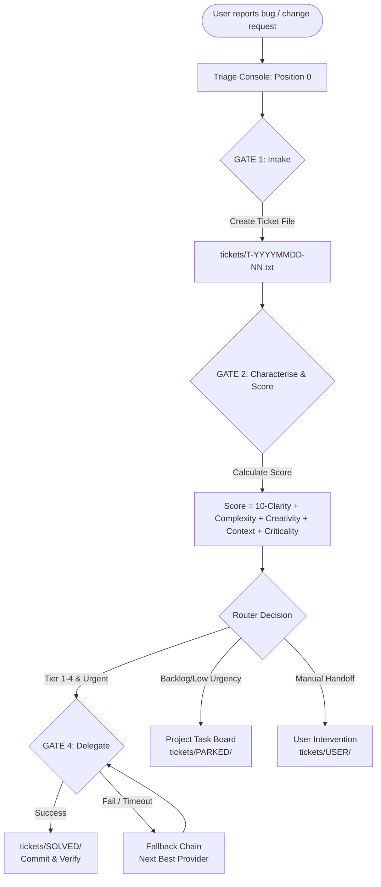

# ticket-master

A cross-platform, multi-provider **workflow / operating mode** for an AI coding agent.

ticket-master is a workflow/operating mode for an AI coding agent, not a tool that
acts on its own. You keep one agent session (**"Position 0"**) open in your terminal;
whenever you notice a bug, a change request, or any project problem, you just type it
in. Following this workflow, the agent captures it as a structured ticket, assigns it
to the right project, scores it, and routes it — delegating to the best available AI
provider/sub-agent for an immediate fix, or filing it into the project's own task
management when delegation is not appropriate. Cross-platform (Windows/macOS/Linux),
multi-provider (Claude Code, Codex, agy/Gemini).

[](LICENSE)
[](VERSION)
[](tests/)
[](pyproject.toml)
[](llms.txt)
[](#starter-matrix)
[](https://github.com/ellmos-ai)
[](https://github.com/open-bricks)

---

🇩🇪 [Deutsche Dokumentation → README_de.md](README_de.md)

> [!NOTE]
> AI agents and RAG indexers can find machine-readable context, search phrases, entry points, and discovery metadata in [llms.txt](llms.txt).

**Release status:** `Unreleased` — `VERSION` and `pyproject.toml` both report
`1.9.0`; the current clone has no Git tag and no release publication is claimed.

---

## How It Works

ticket-master is a **prompt-driven workflow**: the agent reads the TICKET-MASTER
prompt and follows it. Every step below is something the *agent* does by following
the prompt — nothing runs on its own.

```
You report a bug or change request
        |
        v
[A] Intake — ticket file created, project assigned (GATE1)
        |
        v
[2-5] Characterise → Score → Match provider → Rank 3 candidates (GATE2)
        |
        v
[B] Delegate to best available provider (GATE4 success check + fallback chain)
        |
   or   v
[C] Write to project task management (usage limit / all unavailable)
        |
        v
Position 0 — waiting for next ticket
```



Key design principles (how the agent is instructed to behave):

- **Lean Router:** The agent in this mode stays lean. Execution is delegated to
  sub-agents that report back compactly (commit hash + one line).
- **Companion Pattern:** For a series of tickets in the same domain, one companion
  sub-agent is spawned and reused — paying orientation cost once, not per ticket.
- **Score-Based Routing:** The agent scores every ticket on five dimensions (Clarity,
  Complexity, Creativity, Context, Criticality) to determine the required provider
  tier.
- **Graceful Fallback:** If the preferred provider is unavailable, the prompt's
  fallback chain and checkpoint ensure tickets are never dropped.
- **Provider-Agnostic:** Works with any CLI-based LLM provider. The prompt and config
  ship with support for Claude, Codex, and agy (Gemini). Extend via config.
- **Cloud-Ready / Multi-System:** The ticket queue works across multiple machines
  sharing a cloud-synced folder (OneDrive, Dropbox, Google Drive). Claims are
  signalled via filename rename — atomic on NTFS, no lock files needed.

---

## Roles

<p align="center">
  
  &nbsp;&nbsp;
  
</p>

- **TICKET-MASTER**: Lean traffic router &amp; dispatcher. Calmly distributes incoming tickets to worker sub-agents or project task boards.
- **TICKET-WRITER ("SIG-TU")**: System Integrity Guardian. Sentinel with magnifying glass &amp; clipboard; audits proof documents to ensure ABC-level quality.

---

## Quick Start

```bash
# 1. Clone the repository
git clone https://github.com/ellmos-ai/ticket-master.git
cd ticket-master

# 2. Copy and edit the config
cp config/ticket-master.config.example.json config/ticket-master.config.json
# -> Edit config/ticket-master.config.json:
#    - Add your project directories to project_roots[]
#    - Verify provider commands match your installed CLIs

# 3. Launch (default: Claude)
./bin/ticket-master.sh               # Unix/macOS
.\bin\ticket-master.bat              # Windows CMD
.\bin\ticket-master.ps1              # Windows PowerShell
```

This launches your chosen CLI provider with the TICKET-MASTER prompt for the
selected language from configured `prompts_dir` (default:
`prompts/TICKET-MASTER.<lang>.md`, English). The agent
reads the prompt, orients itself on your projects, and goes to **Position 0** —
waiting silently for your first ticket.

### Prompt Language

The agent prompt ships in two fully equivalent versions:

- `prompts/TICKET-MASTER.en.md` (English, default)
- `prompts/TICKET-MASTER.de.md` (German)

Select the language with the `TM_LANG` environment variable; the starters load
`prompts/TICKET-MASTER.${TM_LANG}.md` and fall back to English with a warning if
the requested file is missing. The config field `default_language` documents the
intended default.

```bash
TM_LANG=de ./bin/ticket-master.sh        # German prompt
TM_LANG=en ./bin/ticket-master.sh        # English prompt (default)
```

```powershell
$env:TM_LANG = "de"; .\bin\ticket-master.ps1
```

---

## Starter Matrix

| OS | Provider | Command |
|----|----------|---------|
| Unix / macOS | Claude | `./bin/start-claude.sh` or `./bin/ticket-master.sh --provider claude` |
| Unix / macOS | Codex | `./bin/start-codex.sh` or `./bin/ticket-master.sh --provider codex` |
| Unix / macOS | agy (Gemini) | `./bin/start-agy.sh` or `./bin/ticket-master.sh --provider agy` |
| Windows CMD | Claude | `bin\start-claude.bat` or `bin\ticket-master.bat --provider claude` |
| Windows CMD | Codex | `bin\start-codex.bat` or `bin\ticket-master.bat --provider codex` |
| Windows CMD | agy (Gemini) | `bin\start-agy.bat` or `bin\ticket-master.bat --provider agy` |
| Windows PowerShell | Claude | `.\bin\ticket-master.ps1 -Provider claude` |
| Windows PowerShell | Codex | `.\bin\ticket-master.ps1 -Provider codex` |
| Windows PowerShell | agy (Gemini) | `.\bin\ticket-master.ps1 -Provider agy` |

### Environment Variables

| Variable | Default | Effect |
|----------|---------|--------|
| `TM_PROVIDER` | `claude` | Override provider without a flag |
| `TM_LANG` | `en` | Prompt language; loads `prompts_dir/TICKET-MASTER.${TM_LANG}.md` (falls back to `en`) |
| `TM_CONFIG` | `config/ticket-master.config.json` | Optional path to the local JSON config used by the shared resolver |
| `TM_SKIP_PERMISSIONS` | `0` | Set to `1` to pass `--dangerously-skip-permissions` to Claude |

---

## Configuration

Copy `config/ticket-master.config.example.json` to
`config/ticket-master.config.json` (the real config is gitignored).

### Key Fields

| Field | Description |
|-------|-------------|
| `tickets_dir` | Where ticket files live (default: `./tickets`) |
| `prompts_dir` | Repository-local directory containing `TICKET-MASTER.<lang>.md`; all three starters resolve it through `bin/ticket_master.py` and reject paths escaping the repo root |
| `default_language` | Documented default prompt language (`en`/`de`); runtime override via `TM_LANG` |
| `project_roots[]` | **Your projects** — add name, path, pipeline for each |
| `providers.claude` | Claude CLI config (`command`, `default_model`, `args`) |
| `providers.codex` | Codex CLI config |
| `providers.agy` | Gemini CLI config |
| `default_provider` | Provider used when none is specified |
| `advisor.enabled` | Enable advisor model for high-stakes tickets (score ≥ 35) |
| `advisor.threshold_score` | Score at which advisor is recommended |
| `score_thresholds` | Tier boundary scores (tier1\_max, tier2\_max, etc.) — fallback only, see `router_command` |
| `router_command` | Optional external multi-model/task router; consulted before the score-fallback formula |
| `task_db_command` | Optional "later" sink for `woche`/`backlog`-urgency tickets |

### Example `project_roots` Entry

```json
{
  "name": "my-app",
  "path": "/home/user/projects/my-app",
  "pipeline": "software"
}
```

### Multi-Host Configs: `<HOME>`/`<USER>` Placeholders

If `config/ticket-master.config.json` lives in a folder synced across
several machines, a literal path only resolves on the host it was written
on. `tickets_dir` and any `project_roots[].path` may instead use the
placeholders `<HOME>` (current user's home directory) and `<USER>` (OS user
name) — the agent following the TICKET-MASTER prompt resolves these to the
current host's actual values before any file access. Same convention as
`config/ticket-writer.config.example.json`. See
`config/ticket-master.config.example.json` for a worked example.

### Auditable CLI (`--list` / `--intake`)

The shared Python entry point keeps ticket inspection and intake identical on
Windows, macOS, and Linux:

```bash
python bin/ticket_master.py --list
python bin/ticket_master.py --list --json
python bin/ticket_master.py --intake "Describe the new issue" --project my-app
```

`--list` prints deterministic `STATUS / ID / TITLE / PATH` metadata for open
tickets across all v1 clusters and readable legacy aliases; it never prints
ticket bodies. `--intake` validates and normalizes a description, creates one
exclusive unclaimed `INBOX/` file, and never appends the deprecated shared
intake log. A ticket moves to `QUEUED/` only after an actual provider/agent
handover.
Use `--tickets-dir` for an explicit local queue or `--config` for a local JSON
configuration. A missing default config uses safe repository-local defaults;
an explicitly missing or malformed config exits with a controlled error.

---

## Discovery Context

Use the canonical name **`ellmos-ai/ticket-master`** when searching for this
project. The repository is about **LLM ticket routing**: a prompt-driven triage
console that helps one coding-agent session capture bugs, score them, select a
Claude/Codex/agy provider, and keep an auditable ticket trail.

Good search phrases:

```text
ellmos-ai ticket-master
LLM ticket router agent
AI coding agent triage console
Claude Codex Gemini ticket routing
multi-provider LLM task router
prompt-driven issue intake workflow
companion pattern AI agent workflow
```

Not this project: Ticketmaster event APIs, concert ticket bots, help-desk SaaS,
customer support ticketing, marketplace ticket resale, or a standalone bug tracker
that files issues without an active LLM agent session.

## How Routing Works

### Score Formula

```
SCORE = (10 - CLARITY) + COMPLEXITY + CREATIVITY + CONTEXT + CRITICALITY
```

Each dimension is 0–10. Total range: 0–50.

| Score Range | Tier | Typical Use |
|-------------|------|-------------|
| 0–8 | Tier 1 | Fast / cheap — boilerplate, formatting, trivial fixes |
| 9–12 | Tier 2 | Capable chat — standard bugs, documentation |
| 13–28 | Tier 3 | Capable coder / researcher — complex bugs, code review |
| 29–50 | Tier 4 | Architect / reviewer — design, proofs, high-stakes changes |

At score ≥ 35, an advisor model is recommended.

### Directory Layout

```
tickets/
├── _logs/                      <- DEPRECATED shared intake log (pre-1.5.0)
│   └── INTAKE-TRIAGE-LOG.txt
├── _templates/TICKET.txt       <- ticket template
├── *.txt                       <- open tickets (one .txt file each)
├── INBOX/                      <- newly arrived, not yet triaged (root = alias)
├── ACTIONABLE/                 <- actionable now: no blocker, no user dependency
├── QUEUED/                     <- handed to a provider, awaiting result
├── BLOCKED/                    <- external blocker (host-receipt / foreign-state / lock / quota / dependency)
├── WAITING/                    <- time- or marker-bound (scheduled / review-due / marker)
├── USER/                       <- strictly depends on the user (decision / data / freigabe / hardware / session)
├── PARKED/                     <- deliberately set aside (skip / backlog / until-trigger)
├── SOLVED/                     <- resolved and empirically confirmed
├── PENDING/                    <- LEGACY alias (pre-v1) — readable, no new entries
└── .USER/                      <- LEGACY alias (pre-v1) — superseded by USER/
```

The full category model (entry/exit rules, autonomy loop, STATUS mirroring)
is specified in [docs/CATEGORIES.en.md](docs/CATEGORIES.en.md)
([deutsch](docs/CATEGORIES.de.md)).

The audit/triage trail lives **per ticket** in the ticket file itself
(`STATUS` / `LOG` / `SOLUTION` fields). Trivial tickets that are resolved and
verified immediately get a **minimal** ticket file dropped directly into
`tickets/SOLVED/`. The former shared `tickets/_logs/INTAKE-TRIAGE-LOG.txt` is
**deprecated**: with several machines appending to one cloud-synced file, sync
conflict copies ate log lines.

### Cloud-Ready: Multi-System Claim Convention

When the `tickets/` directory lives in a cloud-synced folder shared across
multiple machines, claims are signalled via the **filename** — no in-file
fields or lock files needed:

| State     | Filename pattern             | Example                          |
|-----------|------------------------------|----------------------------------|
| Unclaimed | `T-YYYYMMDD-NN.txt`         | `T-20260619-01.txt`              |
| Claimed   | `T-YYYYMMDD-NN.<HOST>.txt`  | `T-20260619-01.WORKSTATION.txt`  |
| Solved    | move to `SOLVED/`            | as usual                         |

**Glob patterns:** `tickets/T-??????-??.txt` (unclaimed) · `tickets/T-*.LAPTOP.txt` (mine).

A rename within the same directory is atomic on NTFS and most cloud sync
implementations. If a conflict copy appears, one system has won the claim;
the other rolls back and picks the next unclaimed ticket.

### Companion Pattern

For a series of related tickets, the master spawns one **companion sub-agent**
and reuses it via `SendMessage`. The companion orients itself once (reads
project files, learns conventions) and then processes subsequent tickets without
re-paying that cost. The master rotates the companion when the domain changes
significantly or when its context grows large.

### Fallback Chain

```
Candidate 1
    | fail
    v
Candidate 2
    | fail
    v
Candidate 3
    | fail
    v
CHECKPOINT ALPHA:
    1. Async delegation (sync folder / cron)
    2. Project task management (-> BLOCKED/quota or PARKED/backlog)
    3. User handoff (-> USER/session)
```

---

## Personal-Assistant Expansion (optional): Domain Map, Urgency & Delegation

Three optional layers turn the plain ticket router into a small personal-
assistant triage console, on top of a BACH-style personal-assistant install:

- **Domain map (1.6.0, extended 1.8.0):** `lib/domains_generator.py` generates
  `config/domains.json` — a domain → expert map, cross-referenced against a
  skill registry to flag which experts already exist as standalone skills. It
  only needs BACH at generation time; `config/domains.json` itself is a
  plain, BACH-free JSON file at runtime. `experts[]` is provenance/grouping
  metadata only — the prompt routes directly to the resolved skill(s), never
  to the expert as an intermediate hop. Since 1.8.0, a stage-2 fuzzy pass
  (`fuzzy_match_skills()`, plus an optional `--extra-skills-dir` second skill
  inventory) additionally recognizes experts that govern a whole skill
  FAMILY (`"status": "teilportiert"`, `"matched_skills"`: a list) rather than
  a single 1:1 ported skill. Since T-20260808-02, a stage-0 domain-level pass
  (`match_domain_skill()`) additionally recognizes a standalone skill that
  supersedes a WHOLE boss agent rather than any one of its named experts
  (`"match": "domain"`); a boss with zero orchestrated experts gets a
  synthetic `"__domain__:<boss>"` pseudo-expert instead, since there is
  otherwise nowhere to attach the match. See `config/domains.example.json`
  for the schema.
- **Urgency axis (1.7.0):** `config/urgency.json` (schema:
  `config/urgency.example.json`) maps each domain to a default deadline
  (`sofort` / `heute` / `woche` / `backlog`) plus escalation rules (e.g.
  published software + a severe bug escalates to `sofort`, dispatching a
  diagnosis-only sub-agent first when severity is unclear). This axis is
  **decoupled** from the 5-dimension complexity score — a ticket can be
  low-complexity and urgent, or high-complexity and not urgent. Borderline
  calls can optionally consult a configured preference hint
  (`preference_model_hint.command`); low confidence always means asking the
  user instead of guessing.
- **Delegation wiring (1.7.0, extended 1.8.0):** the prompt's intake gate
  resolves an `ENDPOINT` for a matched domain (via `domains.json`, then
  optional skill-registry tools, then a GAP flag instead of a silent
  fallback); model selection prefers an optional external `router_command`
  over the built-in score-formula fallback; a permission check against
  `LOCK*.txt` / `LOCK.permissions.json`-style conventions runs before every
  worker spawn; and `woche`/`backlog`-urgency tickets are handed to an
  optional `task_db_command` "later" sink instead of spawning a sub-agent.
  Since 1.8.0, a `"teilportiert"` domain match equips the worker with *all*
  skills in `matched_skills`, not just the first — an expert can govern a
  whole skill family (see the domain map section above).
- **System-knowledge layer (1.9.0):** `config/knowledge.json` (schema:
  `config/knowledge.example.json`) lists knowledge sources in four
  categories — `maps` (structural, loaded at boot), `state` (changes during
  the session, re-checked before every routing decision), `capabilities`
  (consulted at endpoint/model lookup), and `user_model` (a preference hint,
  consulted only on genuine borderline calls). Ground rule: trust generated
  maps over memory — on a conflict, regenerate the map rather than trusting
  what you recall.

See `CHANGELOG.md` (1.6.0–1.9.0) for details.

## Requirements

- A CLI-based LLM provider (at least one of: `claude`, `codex`, `agy`)
- Python 3.10+ (for tests only; the router itself runs inside the LLM session)
- No additional Python dependencies

### Provider Installation

| Provider | Install |
|----------|---------|
| Claude CLI | `npm install -g @anthropic-ai/claude-code` |
| Codex CLI | `npm install -g @openai/codex` |
| agy (Gemini) | See [antigravity docs](https://github.com/google-labs-git/agy) |

---

## Running the Smoke Tests

```bash
python tests/test_smoke.py
```

Checks: directory structure complete, config JSON valid, prompt contains no
forbidden absolute paths or system-specific terms.

---

## Part of the ellmos stack family

ticket-master is deliberately both: a standalone dev tool and a core module of
the ellmos stack family.

Core module of [ellmos-ai/agent-ops-stack](https://github.com/ellmos-ai/agent-ops-stack)
(role `ticket-routing`); family/catalog: [ellmos-ai/stacks](https://github.com/ellmos-ai/stacks);
org overview: [ellmos-ai](https://github.com/ellmos-ai).

---

## License

MIT License — Copyright (c) 2026 Lukas Geiger. See [LICENSE](LICENSE).

## Author

Lukas Geiger ([github.com/lukisch](https://github.com/lukisch))
