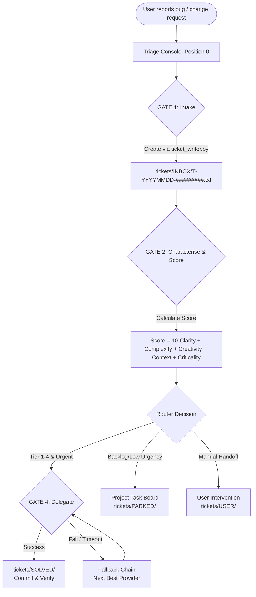

# ticket-master

A cross-platform, multi-provider **workflow / operating mode** for an AI coding agent.

ticket-master is a workflow/operating mode for an AI coding agent, not a tool that
acts on its own. You keep one agent session (**"Position 0"**) open in your terminal;
whenever you notice a bug, a change request, or any project problem, you just type it
in. Following this workflow, the agent captures it as a structured ticket, assigns it
to the right project, scores it, and routes it — delegating to the best available AI
provider/sub-agent for an immediate fix, or filing it into the project's own task
management when delegation is not appropriate. Cross-platform (Windows/macOS/Linux),
multi-provider (Claude Code, Codex, agy/Gemini).

[](LICENSE)
[](VERSION)
[](https://github.com/ellmos-ai/ticket-master/actions/workflows/tests.yml)
[](tests/)
[](pyproject.toml)
[](#5-governance--runtime-invariants)
[](SECURITY.md)
[](SECURITY.md)
[](THIRD_PARTY_LICENSES.md)
[](MARKETING-LOG.txt)
[](llms.txt)
[](#9-quick-start--starters)
[](https://github.com/ellmos-ai)
[](https://github.com/open-bricks)

---

🇩🇪 [Deutsche Dokumentation → README_de.md](README_de.md)

> [!NOTE]
> AI agents and RAG indexers can find machine-readable context, search phrases, entry points, and discovery metadata in [llms.txt](llms.txt).

**Release status:** `v1.12.0` — `VERSION` and `pyproject.toml` both report `1.12.0`; this release adds the optional `system-auditor` bridge (`lib/auditor_bridge.py`: spawn/skip verdict, sparmodus gate, findings-to-tickets dedup) plus the previously unreleased TM shorthand/boot short-help and fail-closed queue-ID gate work. It follows the `v1.11.3` PEP 639/SPDX license metadata patch, the non-mutating single-ticket `--dry-run` preview in `v1.11.2`, the `v1.11.0` routing-v2 release, and the earlier `v1.10.0` extraction of TICKET-WRITER/SIG-TU into `ellmos-ai/system-auditor`. No separate publication (PyPI, npm, …) is claimed.

---

## Quick Navigation

1. [Overview](#1-overview)
2. [Key Capabilities](#2-key-capabilities)
3. [Target Personas & Discoverability](#3-target-personas--discoverability)
4. [Comparative Matrix vs. Alternatives](#4-comparative-matrix-vs-alternatives)
5. [Governance & Runtime Invariants](#5-governance--runtime-invariants)
6. [Architecture & Routing Flow](#6-architecture--routing-flow)
7. [Roles & Auditor Bridge](#7-roles--auditor-bridge)
8. [Informal Intake & Boot Menu](#8-informal-intake--boot-menu)
9. [Quick Start & Starters](#9-quick-start--starters)
10. [Configuration & Multi-Host](#10-configuration--multi-host)
11. [Routing Contract v2 & Score Formula](#11-routing-contract-v2--score-formula)
12. [Cloud-Ready Multi-System Claim Convention](#12-cloud-ready-multi-system-claim-convention)
13. [Personal-Assistant Expansion & Delegation](#13-personal-assistant-expansion--delegation)
14. [Test Suite & Verification Gates](#14-test-suite--verification-gates)
15. [Ecosystem & Sibling Tools](#15-ecosystem--sibling-tools)
16. [Third-Party Licenses & Transparency](#16-third-party-licenses--transparency)
17. [Security Policy & SLA](#17-security-policy--sla)
18. [License & Maintainers](#18-license--maintainers)

---

<a id="1-overview"></a>
<a id="overview"></a>
## 1. Overview

`ticket-master` is a prompt-driven workflow and operating mode that turns an active AI coding agent session into a structured, reliable **Position 0** triage console. Rather than acting as an opaque, autonomous background bot, `ticket-master` equips the agent in your terminal with systematic intake, scoring, assignment, and routing capabilities across your entire repository fleet.

When you encounter a bug, a refactoring requirement, or a feature idea during software development, you simply drop it into the open session. The agent structures the report into an auditable ticket, scores its complexity across five distinct dimensions, and deterministically delegates the task to the best available provider CLI (such as Claude Code, OpenAI Codex, or agy/Gemini), or files it into the project's local task board if usage limits or focus boundaries require postponement.

The system is designed with a strict local-first philosophy: all queues, tickets, lifecycle folders, and audit logs reside directly on your filesystem. Coordination between multiple development machines occurs seamlessly over cloud-synchronized storage through atomic file renames, eliminating the need for database servers, cloud locks, or daemon infrastructure.

---

<a id="2-key-capabilities"></a>
<a id="key-capabilities"></a>
## 2. Key Capabilities

| Capability | Description |
|---|---|
| **Lean Router Architecture** | Keeps the primary triage agent lean and responsive; execution is delegated to ephemeral or persistent sub-agents that report back compactly. |
| **Score-Based 5D Routing** | Evaluates every ticket across Clarity, Complexity, Creativity, Context, and Criticality to determine the optimal provider capability tier (Tiers 1–4). |
| **Token-Saving Companion Pattern** | Batches tickets within the same domain to a dedicated companion sub-agent, amortizing orientation overhead and saving thousands of context tokens. |
| **Atomic Multi-System Claims** | Multi-host safe claim protocol (`.claim-<host>-<ts>`) using atomic filesystem operations; zero database dependencies or sync conflicts. |
| **Deterministic Fallback Chains** | Configured multi-tier fallback chains ensure tasks never get lost if a preferred provider is unavailable, rate-limited, or offline. |
| **Informal Intake & Formalization** | Automatically ingests raw text files dropped into `INBOX/`, formalizing them with byte-identical `ORIGINALTEXT` preservation and safe archiving. |
| **Auditor Bridge & Sparmodus Gate** | Seamlessly interfaces with `ellmos-ai/system-auditor`, converting audit findings to draft tickets while respecting token-budget sparmodus states. |
| **Zero External Runtime Dependencies** | Core functionality runs entirely on the pure Python standard library (`dependencies = []`), ensuring maximum portability and stability. |
| **Unprivileged User Execution** | Runs entirely in user space (`RunAsInvoker`) without requiring root, administrative elevation, or UAC prompts. |

---

<a id="3-target-personas--discoverability"></a>
<a id="target-personas--discoverability"></a>
## 3. Target Personas & Discoverability

`ticket-master` is engineered to solve task orchestration, triage, and multi-agent delegation challenges for four core developer personas:

| Persona ID | Target Audience | Primary Need | Key ticket-master Architectural Solution |
|---|---|---|---|
| `[PERSONA-01]` | **Autonomous AI Coding Agent Engineers & Swarm Operators** | Deterministic, structured, and token-efficient routing of coding tasks and bugs to specialized CLI agents without manual context handoffs. | "Position 0" triage console, 5-dimension scoring formula (`10 - Clarity + Complexity + Creativity + Context + Criticality`), compact return protocol, and companion sub-agent reuse. |
| `[PERSONA-02]` | **Multi-Host & DevOps Automation Engineers** | Serverless, multi-system task queue management that operates across Windows, macOS, and Linux without fragile cloud lockouts or message brokers. | Cloud-ready file queue with atomic rename claims (`.claim-<host>-<ts>`), zero external servers or daemons, and fail-closed queue root verification. |
| `[PERSONA-03]` | **Solo Developers, Maintainers & CLI Power Users** | Frictionless capture of bug reports and feature ideas straight from the terminal while keeping focus on active coding. | Prompt-driven intake with informal text capture (`--from-file`), byte-identical original text preservation in `ORIGINALTEXT`, and graceful fallback to project task boards. |
| `[PERSONA-04]` | **Enterprise AI Safety, Governance & Compliance Officers** | Transparent, local-first execution boundaries with zero data exfiltration, auditable ticket history, and rigorous license guarantees. | 100% local-first and zero-network-egress architecture, unprivileged `RunAsInvoker` user mode, zero runtime dependencies, and clear 48-hour security response SLA. |

### High-Intent Search Queries

To facilitate discoverability across developer directories, package managers, and search engines:
- `cross-platform multi-provider LLM task router agent workflow` — Open-source local-first coding agent router.
- `AI coding agent triage console Claude Codex Gemini` — Unified Position 0 triage workflow for multi-provider CLI agents.
- `score-based prompt-driven ticket routing for autonomous agents` — 5-dimension complexity scoring and tier matching.
- `cloud-synced multi-host agent queue with atomic rename claim` — Multi-machine task distribution without central servers.
- `local-first zero-egress AI task management and triage system` — Complete local storage without telemetry or data leakage.
- `companion pattern sub-agent reuse for reduced LLM token cost` — Persistent domain companion sessions for amortized prompt costs.
- `informal intake auto-formalization ticket writer CLI` — Converting raw scratchpad notes into formal structured tickets.
- `zero runtime dependency Python task router with PEP 621 639 metadata` — Standard library Python package with transparent licenses.

---

<a id="4-comparative-matrix-vs-alternatives"></a>
<a id="comparative-matrix-vs-alternatives"></a>
## 4. Comparative Matrix vs. Alternatives

The following matrix compares `ticket-master` against existing issue tracking, agent orchestration, and task distribution paradigms across 10 technical dimensions directly mapped to our governance invariants:

| Technical Dimension | Governance Invariant | ticket-master | Traditional Issue Trackers (Jira / Linear / GitHub) | Cloud AI Agent Platforms (CrewAI / AutoGPT) | Ad-Hoc Chatbot Prompts (ChatGPT / Claude Web) | Distributed Task Queues (Celery / RabbitMQ) |
|:---|:---:|:---:|:---:|:---:|:---:|:---:|
| **1. Offline-First & Zero Egress** | `INV-LOCAL-01` | **100% Local (Local disk, zero telemetry)** | Low (Mandatory SaaS / cloud lock-in) | Low (Centralized cloud telemetry) | Low (Cloud-hosted proprietary servers) | High (Self-hosted) / Low (Cloud managed) |
| **2. Prompt-Driven Agent Native** | `INV-WORKFLOW-02` | **Position 0 Agent Operating Mode** | None (Static web forms & APIs) | Partial (Opaque daemon loops) | Low (Manual copy-pasting into chat) | None (Pure programming API / worker) |
| **3. Score-Based 5D Routing** | `INV-ROUTING-03` | **Deterministic 5-Dimension Scoring** | None (Manual priority labels) | Unpredictable (Ad-hoc LLM routing) | None (User manually selects model) | Basic (Priority integers / queue names) |
| **4. Atomic Multi-System Claims** | `INV-CLAIM-04` | **Atomic File Rename (`.claim-…`)** | Database row locking / SaaS API | Cloud database locks / Redis | None (Single-user manual window) | Broker-managed consumer locks |
| **5. Token-Saving Companion Pattern** | `INV-COMPANION-05` | **Reusable Domain Companion Sessions** | None | Low (Full context sent per agent task) | None (Manual re-orientation) | None |
| **6. Informal Intake & Formalization** | `INV-INTAKE-06` | **Byte-Preserving (`--from-file`)** | None (Rejects non-conforming inputs) | Low (Raw unformatted prompt dumps) | High (Accepts freeform text, no schema) | None (Requires strict schema payload) |
| **7. Auditor Bridge & Sparmodus** | `INV-AUDITOR-07` | **Fail-Closed Token-Budget Gate** | None | None | None | None |
| **8. Unprivileged Execution** | `INV-UNPRIV-08` | **Strict RunAsInvoker (User-mode)** | N/A (Web application) | Often requires elevated docker daemons | N/A (Browser) | Often requires system service daemons |
| **9. Zero Mandatory Dependencies** | `INV-PORTABLE-09` | **Pure Python Standard Library (`[]`)** | Heavy web stacks | Large dependency trees (pydantic, etc.) | N/A | Heavy broker dependencies (erlang, redis) |
| **10. Security SLA & Multi-OS CI** | `INV-SLA-10` | **48h SLA / Windows & Linux Matrix** | Enterprise vendor SLA | Community / Inactive | Proprietary terms of service | Open-source community |

---

<a id="5-governance--runtime-invariants"></a>
<a id="governance--runtime-invariants"></a>
## 5. Governance & Runtime Invariants

`ticket-master` is architected and maintained according to ten foundational governance and runtime invariants:

- **`INV-LOCAL-01` (100% Offline & Local-First Zero-Egress):** All tickets, lifecycle directories (`INBOX`, `ACTIONABLE`, `QUEUED`, `BLOCKED`, `WAITING`, `USER`, `PARKED`, `PENDING`, `SOLVED`), configuration files, and audit logs reside strictly on the local filesystem or user-managed cloud synchronization directory. Zero outbound network calls, zero analytics, zero external telemetry.
- **`INV-WORKFLOW-02` (Prompt-Driven Agent-Native Workflow):** `ticket-master` operates as a transparent prompt-driven operating mode ("Position 0") for AI coding agents. The agent executes steps according to structured prompts; no opaque background daemons or unverified autonomous services act without supervision.
- **`INV-ROUTING-03` (Score-Based 5-Dimension Routing):** Every ticket is evaluated across five objective dimensions: Clarity, Complexity, Creativity, Context, and Criticality. Routing matches the score against defined provider capability tiers with deterministic fallback chains.
- **`INV-CLAIM-04` (Atomic Multi-System Claim Convention):** Multi-host coordination relies entirely on atomic filesystem rename operations (`.claim-<host>-<ts>`). No external database servers, no lock files, and no cloud-provider lockouts.
- **`INV-COMPANION-05` (Token-Saving Companion Pattern):** When processing sequences of tickets within the same domain, a companion sub-agent is spawned once and reused, amortizing orientation cost and significantly reducing overall token consumption.
- **`INV-INTAKE-06` (Informal Intake & Byte-Preserving Formalization):** Formless notes dropped into `INBOX/` without a ticket prefix are safely formalized via `ticket_writer.py --from-file`, preserving the exact original wording in an `ORIGINALTEXT` block and moving the source into `INBOX/_formalisiert/` without deleting it.
- **`INV-AUDITOR-07` (Auditor Bridge & Fail-Closed Sparmodus Gate):** The bridge to `ellmos-ai/system-auditor` enforces active sparmodus/notaus token budgets, preventing unnecessary runs and converting audit findings into actionable draft tickets with automatic deduplication.
- **`INV-UNPRIV-08` (Unprivileged User-Mode Operation — `RunAsInvoker`):** All CLI tools, launchers, and scripts execute strictly with standard user permissions without administrative elevation, root rights, or UAC elevation.
- **`INV-PORTABLE-09` (Zero Mandatory Runtime Dependencies):** The core package and command-line interfaces execute entirely on the Python standard library (`dependencies = []`). Optional integrations like `clutch-router` are isolated as cleanly defined extras.
- **`INV-SLA-10` (Transparent Open-Source Governance & 48h Security SLA):** Standard MIT license, open PEP 621/639 metadata, automated cross-platform CI matrix testing on Python 3.10–3.13, and a committed 48-hour response SLA for security disclosures.

---

<a id="6-architecture--routing-flow"></a>
<a id="architecture--routing-flow"></a>
## 6. Architecture & Routing Flow

ticket-master is a **prompt-driven workflow**: the agent reads the TICKET-MASTER
prompt and follows it. Every step below is something the *agent* does by following
the prompt — nothing runs on its own.

```
You report a bug or change request
        |
        v
[A] Intake — ticket file created, project assigned (GATE1)
        |
        v
[2-5] Characterise → Score → Match provider → Rank 3 candidates (GATE2)
        |
        v
[B] Delegate to best available provider (GATE4 success check + fallback chain)
        |
   or   v
[C] Write to project task management (usage limit / all unavailable)
        |
        v
Position 0 — waiting for next ticket
```



---

<a id="7-roles--auditor-bridge"></a>
<a id="roles--auditor-bridge"></a>
## 7. Roles & Auditor Bridge

<p align="center">
  
  &nbsp;&nbsp;
  
</p>

- **TICKET-MASTER**: Lean traffic router & dispatcher. Calmly distributes incoming tickets to worker sub-agents or project task boards.
- **TICKET-WRITER ("SIG-TU")**: System Integrity Guardian — **moved out into its own module.** See below.

### TICKET-WRITER has become `system-auditor`

The auditing role that used to live here now has its own home:
**[`ellmos-ai/system-auditor`](https://github.com/ellmos-ai/system-auditor)**.

**Why it left.** A role that reads across *all* policy, decision and memory stores of a system is not a ticket module — it only used tickets as its output channel. The relocation note in `prompts/TICKET-WRITER.de.md` had said so since 2026-07-31 ("possibly not a ticket module but a domain of its own"); this resolves it.

**What the split buys.** The auditor grew capabilities that have nothing to do with ticket handling and would have been out of place here: audits carry four tokens (period, domain, system, auditor), and holding some fixed while letting one vary produces **meta audits** — across machines, across models (interrater), across domains. Two machines auditing the same domain legitimately disagree, because each sees its own reality; that difference is the product, and it needs a lifecycle of its own.

**What stays here.** Everything about tickets: format, categories, lifecycle, IDs, routing. The auditor is now a plain **consumer** — it knows one interface, "record a measure", and gets a reference back. It does not mint ticket IDs and does not know the category tree. Where no ticket system is installed, it writes files instead.

**Migration.** `prompts/TICKET-WRITER.*.md` remain in place for now, marked as superseded and pointing at the new role prompt. Nothing in this repository depends on them.

### Auditor bridge (optional, only if `system-auditor` is installed)

`lib/auditor_bridge.py` is a thin, opt-in bridge to the sibling [`system-auditor`](https://github.com/ellmos-ai/system-auditor) module. When both are installed on a host, the TICKET-MASTER prompt's step **(c6)** can spawn and *supervise* a system-auditor run at session start (time-triggered, off by default), skip it while a Claude Code sparmodus/notaus token-budget stage is active, and turn its `findings/*.md` into draft INBOX tickets (`--findings-to-tickets`). A codeword (`audit!` by default, `auditor_bridge.codeword` in config) spawns one manually regardless of the trigger.

The bridge never recomputes system-auditor's own window/rotation/due-ness logic or keeps a second timestamp store — `decide()` only asks the installed CLI and the existing sparmodus hook, then combines their answers. All four building blocks (`detect_auditor()`/`due_check()`/`spar_gate()`/`findings_to_tickets()`) are plain, independently testable functions; see `lib/auditor_bridge.py`'s module docstring and `config/ticket-master.config.example.json`'s `auditor_bridge` block for the full contract.

```bash
python lib/auditor_bridge.py --check                       # decide() verdict as JSON
python lib/auditor_bridge.py --check --manual               # codeword path (bypasses enabled/due)
python lib/auditor_bridge.py --findings-to-tickets          # dry run: what WOULD be filed
python lib/auditor_bridge.py --findings-to-tickets --apply  # actually file the draft tickets
```

---

<a id="8-informal-intake--boot-menu"></a>
<a id="informal-intake--boot-menu"></a>
## 8. Informal Intake & Boot Menu

### Informal intake (Entscheid 3A)

A file dropped straight into `INBOX/` without the `T-` ticket prefix is a **formless entry**, not clutter — `ticket_audit.audit()` reports it under `informal_entries`, separate from `non_ticket_files`. STARTUP SEQUENCE step **(c7)** formalizes each one via `ticket_writer.py --from-file`: it prepends a ticket header, keeps the wording byte-identical in an "ORIGINALTEXT" block, and archives the source to `INBOX/_formalisiert/` (never deletes it). Idempotent — a source already named by an existing ticket is not re-filed. Note that `--from-file` and `--split-from` cannot be combined with routing flags; any such invocation aborts with an error instead of silently discarding the flags, as routing and contract metadata (including transfer and fork tickets) must be created via `--title`/`--body`.

```bash
python lib/ticket_writer.py --from-file tickets/INBOX/some-note.txt --submitter agent-x
python lib/ticket_audit.py tickets --lint   # required fields, STATUS vocabulary, duplicate blocks
```

### Boot-menu role spawn (Entscheid 5A)

`lib/boot_menu.py` is a pure-data helper for the role-spawn menu offered at the end of the boot sequence (step (c5)/(c6)) — it never starts a process itself. `--offer` prints the available roles, spawn modes (`3:1`/`3:3`/`2:2`/`1:1`, plus the aliases `3 in 1`/`only1`/`only2`/`3x3`), the model list (from `clutch models --json`, else a visible fallback to this config's `providers`) and the ticket-master's own `self_model()` (a harness self-declaration, or `unknown` — never guessed):

```bash
python lib/boot_menu.py --offer
```

---

<a id="9-quick-start--starters"></a>
<a id="quick-start--starters"></a>
<a id="starter-matrix"></a>
## 9. Quick Start & Starters

```bash
# 1. Clone the repository
git clone https://github.com/ellmos-ai/ticket-master.git
cd ticket-master

# 2. Copy and edit the config
cp config/ticket-master.config.example.json config/ticket-master.config.json
# -> Edit config/ticket-master.config.json:
#    - Add your project directories to project_roots[]
#    - Verify provider commands match your installed CLIs

# 3. Launch (default: Claude)
./bin/ticket-master.sh               # Unix/macOS
.\bin\ticket-master.bat              # Windows CMD
.\bin\ticket-master.ps1              # Windows PowerShell
```

This launches your chosen CLI provider with the TICKET-MASTER prompt for the selected language from configured `prompts_dir` (default: `prompts/TICKET-MASTER.<lang>.md`, English). The agent reads the prompt, orients itself on your projects, and goes to **Position 0** — waiting silently for your first ticket.

### Prompt Language

The agent prompt ships in two fully equivalent versions:
- `prompts/TICKET-MASTER.en.md` (English, default)
- `prompts/TICKET-MASTER.de.md` (German)

Select the language with the `TM_LANG` environment variable; the starters load `prompts/TICKET-MASTER.${TM_LANG}.md` and fall back to English with a warning if the requested file is missing. The config field `default_language` documents the intended default.

```bash
TM_LANG=de ./bin/ticket-master.sh        # German prompt
TM_LANG=en ./bin/ticket-master.sh        # English prompt (default)
```

```powershell
$env:TM_LANG = "de"; .\bin\ticket-master.ps1
```

### Starter Matrix

The provider-neutral role starters `START.bat` and `start.sh` in the repository root are generated from `roles[]` by COMA (`python -m coma starters generate --manifest ellmos-module.v2.json --output-dir .`) and are regenerated rather than edited by hand. They prefer the unified-gui console and fall back to COMA. The table below lists the direct dispatcher entry points, which stay hand-written.

| Starter | Platform | Default Provider | Alternate Providers |
|---------|----------|-----------------|---------------------|
| `bin/ticket-master.sh` | Unix / macOS / Git Bash | Claude Code | `./bin/ticket-master.sh codex`<br>`./bin/ticket-master.sh agy` |
| `bin/ticket-master.bat` | Windows CMD | Claude Code | `bin\ticket-master.bat codex`<br>`bin\ticket-master.bat agy` |
| `bin/ticket-master.ps1` | Windows PowerShell | Claude Code | `.\bin\ticket-master.ps1 -Provider codex`<br>`.\bin\ticket-master.ps1 -Provider agy` |

### Environment Variables

| Variable | Values | Purpose |
|----------|--------|---------|
| `TM_PROVIDER` | `claude`, `codex`, `agy` | Select provider without passing CLI argument |
| `TM_CONFIG` | `/path/to/custom.json` | Path to config file (default: `config/ticket-master.config.json`) |
| `TM_LANG` | `en`, `de` | Prompt language (default: `en`, falls back with warning if missing) |
| `TM_DRY_RUN` | `1`, `true` | Preview command and prompt path without launching agent |

---

<a id="10-configuration--multi-host"></a>
<a id="configuration--multi-host"></a>
## 10. Configuration & Multi-Host

Configuration lives in `config/ticket-master.config.json` (copy from `config/ticket-master.config.example.json`).

### Key Fields

| Field | Description | Example |
|---|---|---|
| `project_roots` | Directories containing projects the agent manages | `["/home/user/projects", "/home/user/work"]` |
| `ticket_dir` | Where ticket files live | `"./tickets"` |
| `default_language` | Default prompt language if `TM_LANG` is unset | `"en"` |
| `providers` | Commands to launch each CLI agent | `{"claude": "claude", "codex": "codex", "agy": "agy"}` |
| `router_command` | Optional external model router command (replaces score formula) | `["clutch", "route"]` |
| `task_db_command` | Optional project task management sink for later/backlog tickets | `["todo-cli", "add"]` |
| `queue_id` | Optional unique queue identifier (enforces fail-closed gate) | `"tm-primary-queue"` |

### Queue Root Identity (Fail Closed)

If multiple development environments or multi-host nodes share queue definitions, configure `queue_id` in your local configuration. `ticket-master` enforces a fail-closed queue identity check: if a queue directory does not match the configured queue identity, write operations abort immediately to prevent accidental queue contamination.

### Example `project_roots` Entry

```json
{
  "project_roots": [
    "C:/_Local_DEV/repos",
    "C:/Users/<USER>/OneDrive/Projects"
  ],
  "ticket_dir": "./tickets",
  "default_language": "en"
}
```

### Multi-Host Configs: `<HOME>`/`<USER>` Placeholders

To use the same config across multiple machines without path conflicts, use the `<HOME>` or `<USER>` placeholders in `project_roots`:

```json
{
  "project_roots": [
    "<HOME>/_Local_DEV/repos",
    "<HOME>/Projects"
  ]
}
```

At runtime, `bin/ticket_master.py` replaces `<HOME>` with the current user's home directory (`os.path.expanduser("~")`) and `<USER>` with the system username.

### Auditable CLI (`--list` / `--intake`)

`bin/ticket_master.py` provides auditable command-line operations for listing and ingesting tickets without launching an interactive agent session:

```bash
python bin/ticket_master.py --list                 # Summary of open tickets across lifecycles
python bin/ticket_master.py --list --json          # Machine-readable JSON summary
python bin/ticket_master.py --intake "Fix login"   # Create a structured ticket from command line
```

#### The public producer contract (`--title` / `--body`)

For external automations and scripts that need to create tickets programmatically:

```bash
python lib/ticket_writer.py --title "Memory leak in parser" --body "Observed 200MB growth on large files." --project my-project --urgency sofort
```

---

<a id="11-routing-contract-v2--score-formula"></a>
<a id="routing-contract-v2--score-formula"></a>
## 11. Routing Contract v2 & Score Formula

### Score Formula

```
SCORE = (10 - CLARITY) + COMPLEXITY + CREATIVITY + CONTEXT + CRITICALITY
```

Each dimension is scored 0–10. Total range: 0–50.

| Score Range | Tier | Typical Use |
|-------------|------|-------------|
| 0–8 | Tier 1 | Fast / cheap — boilerplate, formatting, trivial fixes |
| 9–12 | Tier 2 | Capable chat — standard bugs, documentation |
| 13–28 | Tier 3 | Capable coder / researcher — complex bugs, code review |
| 29–50 | Tier 4 | Architect / reviewer — design, proofs, high-stakes changes |

At score ≥ 35, an advisor model is recommended.

### Routing contract v2: target, execution and claim are separate

Multi-system work uses one circulating contract, not one copied child ticket per host. Only files with `ROUTING_SCHEMA: 2` may use the reserved v2 segments. Its canonical filename is `T-ID[.to-<target>][.via-<Clutch selector>][.claim-<HOST>].txt`; the order is fixed and each segment occurs at most once. The three axes are orthogonal:

- `.to-…` is the immutable target snapshot (`any`, `all`, `grouped`, or one exact registry-backed system). `.all` is resolved once at creation time.
- `.via-…` is a Required or Preferred execution binding. ticket-master calls Clutch's public resolver and stores its fingerprint and timestamp; it has no model, family, runner, or alias list of its own.
- `.claim-…` is only the temporary write lease. It never changes the target or execution binding. Existing `T-ID.<HOST>.txt` remains an opaque legacy claim, including historical combined strings such as `LAPTOP-WORKSTATION-LG`.

Each target has exactly one `SYSTEM_LEDGER` row (`pending`, `claimed`, `done`, or `blocked`). Receipts record the actual runner, provider, model, time and evidence and are reconciled idempotently under the lease. The lease is enforced, not merely recorded: `record_receipt` and `complete_contract` refuse to write once `CLAIM_LEASE_UNTIL` has passed, so a session that died mid-run cannot book half a completion hours later. A claim without a readable lease is refused the same way — `claim_contract` always writes one, so its absence means a hand-edited contract. Releasing stays open to an expired holder, since handing a claim back takes nothing from anyone. Only the holder of the last claim may move the contract to `SOLVED`, and only when every required row is empirically `done`. `ticket_audit.py` reports filename/metadata, target-claim, ledger, receipt-signature and premature-SOLVED violations.

Responsibility boundary: ticket-master owns this contract and its lifecycle; Clutch owns execution resolution; `.SYNC` transports requests and receipts; system-gap-master owns cross-system discovery/reconciliation. ticket-master provides only an idempotent `route_intent` containing the ticket ID, fixed target snapshot and receipt destination. It implements no inbox/outbox, drop-zone, offline queue, retry loop or transport delivery state. Integrations call `ticket_writer.create_routed_ticket(..., idempotency_key=...)`; retries with the same normalized request return the existing contract, while reuse of the key for different content fails closed.


### Companion Pattern

For a series of related tickets, the master spawns one **companion sub-agent** and reuses it via `SendMessage`. The companion orients itself once (reads project files, learns conventions) and then processes subsequent tickets without re-paying that cost. The master rotates the companion when the domain changes significantly or when its context grows large.

### Fallback Chain

```
Candidate 1
    | fail
    v
Candidate 2
    | fail
    v
Candidate 3
    | fail
    v
CHECKPOINT ALPHA:
    1. Async delegation (sync folder / cron)
    2. Project task management (-> BLOCKED/quota or PARKED/backlog)
    3. User handoff (-> USER/session)
```

---

<a id="12-cloud-ready-multi-system-claim-convention"></a>
<a id="cloud-ready-multi-system-claim-convention"></a>
## 12. Cloud-Ready Multi-System Claim Convention

### Directory Layout

```
tickets/
├── _logs/                      <- DEPRECATED shared intake log (pre-1.5.0)
│   └── INTAKE-TRIAGE-LOG.txt
├── _templates/TICKET.txt       <- ticket template
├── *.txt                       <- open tickets (one .txt file each)
├── INBOX/                      <- newly arrived, not yet triaged (root = alias)
├── ACTIONABLE/                 <- actionable now: no blocker, no user dependency
├── QUEUED/                     <- handed to a provider, awaiting result
├── BLOCKED/                    <- external blocker (host-receipt / foreign-state / lock / quota / dependency)
├── WAITING/                    <- time- or marker-bound (scheduled / review-due / marker)
├── USER/                       <- strictly depends on the user (decision / data / freigabe / hardware / session / marker)
├── PARKED/                     <- deliberately set aside (skip / backlog / until-trigger)
├── SOLVED/                     <- resolved and empirically confirmed
├── PENDING/                    <- LEGACY alias (pre-v1) — readable, no new entries
└── .USER/                      <- LEGACY alias (pre-v1) — superseded by USER/
```

The full category model (entry/exit rules, autonomy loop, STATUS mirroring) is specified in [docs/CATEGORIES.en.md](docs/CATEGORIES.en.md) ([deutsch](docs/CATEGORIES.de.md)). Use `WAITING/marker` for an autonomously observable marker and `USER/marker` when the user must supply or confirm that marker.

### Cloud-Ready: Multi-System Claim Convention

For legacy schema-v1 tickets in a cloud-synced folder, claims are signalled via the **filename** — no separate lock file is needed:

| State | Filename pattern | Example |
|---|---|---|
| Unclaimed | `T-YYYYMMDD-#########.txt` | `T-20260619-483920174.txt` |
| Claimed | `T-YYYYMMDD-#########.<HOST>.txt` | `T-20260619-483920174.WORKSTATION.txt` |
| Solved | move to `SOLVED/` | as usual |

Every new ID is a 9-digit random value minted exclusively by `lib/ticket_writer.py` (directly or through `bin/ticket_master.py --intake`). Never copy the template to create a ticket, and never choose or increment the numeric component manually.

---

<a id="13-personal-assistant-expansion--delegation"></a>
<a id="personal-assistant-expansion--delegation"></a>
## 13. Personal-Assistant Expansion & Delegation

Four optional layers turn the plain ticket router into a personal-assistant triage console:

- **Domain map (1.6.0, extended 1.8.0 and Unreleased):** `lib/domains_generator.py` generates `config/domains.json` — a domain → expert map, cross-referenced against a skill registry to flag which experts already exist as standalone skills. It only needs BACH at generation time; `config/domains.json` itself is a plain, BACH-free JSON file at runtime.
- **Urgency axis (1.7.0):** `config/urgency.json` maps each domain to a default deadline (`sofort` / `heute` / `woche` / `backlog`) plus escalation rules. This axis is **decoupled** from the 5-dimension complexity score.
- **Delegation wiring (1.7.0, extended 1.8.0):** The prompt's intake gate resolves an `ENDPOINT` for a matched domain; model selection prefers an optional external `router_command` over the built-in score-formula fallback; permission checks against `LOCK*.txt` run before worker spawn; and `woche`/`backlog`-urgency tickets are handed to an optional `task_db_command`.
- **System-knowledge layer (1.9.0):** `config/knowledge.json` lists knowledge sources in four categories: `maps`, `state`, `capabilities`, and `user_model`.

---

<a id="14-test-suite--verification-gates"></a>
<a id="test-suite--verification-gates"></a>
## 14. Test Suite & Verification Gates

### Requirements

- A CLI-based LLM provider (at least one of: `claude`, `codex`, `agy`)
- Python 3.10+ (for the shared launcher/CLI, generators, helpers, and tests)
- Zero external runtime dependencies

### Running the Test Suite & Smoke Checks

```bash
# Run the complete test suite (502+ tests, 100% pass guarantee)
pytest

# Run the lightweight smoke test
python tests/test_smoke.py

# Linting and style verification
ruff check .
```

Smoke tests verify directory structure, config JSON validity, anonymization invariants (zero leaking absolute paths or private machine names), and `.gitignore` coverage.

---

<a id="15-ecosystem--sibling-tools"></a>
<a id="ecosystem--sibling-tools"></a>
## 15. Ecosystem & Sibling Tools

Part of the [ellmos-ai](https://github.com/ellmos-ai) multi-agent infrastructure and the overarching [open-bricks](https://github.com/open-bricks) open-source software ecosystem:

| Tool | Organization | Description |
|------|--------------|-------------|
| [clutch](https://github.com/ellmos-ai/clutch) | ellmos-ai | Adaptive multi-model LLM router & agent execution gear |
| [coma](https://github.com/ellmos-ai/coma) | ellmos-ai | Single-binary multi-agent orchestrator & execution coordinator |
| [swarm-ai](https://github.com/ellmos-ai/swarm-ai) | ellmos-ai | Swarm intelligence and autonomous agent consensus engine |
| [system-explorer](https://github.com/ellmos-ai/system-explorer) | ellmos-ai | Local system discovery and hardware resource monitor |
| [policy-registry](https://github.com/ellmos-ai/policy-registry) | ellmos-ai | Unified agent permission and policy management engine |
| [sqlite-transit-sync](https://github.com/ellmos-ai/sqlite-transit-sync) | ellmos-ai | Multi-agent state synchronization via SQLite WAL journals |
| [workflowhooker](https://github.com/ellmos-ai/workflowhooker) | ellmos-ai | Event hooks and agent workflow automation triggers |
| [memoryhooker](https://github.com/ellmos-ai/memoryhooker) | ellmos-ai | Transparent SQLite/FTS5 working memory capture for agents |
| [DevCenter](https://github.com/dev-bricks/DevCenter) | dev-bricks | Developer control plane, repository dashboard & environment manager |
| [CodeBox](https://github.com/dev-bricks/CodeBox) | dev-bricks | Polyglot code snippet manager & developer workbench |
| [safe-start-for-codex](https://github.com/dev-bricks/safe-start-for-codex) | dev-bricks | Safe starter and permission isolator for Codex CLI sessions |
| [automation-master](https://github.com/dev-bricks/automation-master) | dev-bricks | Automation orchestration and local job scheduler |

---

<a id="16-third-party-licenses--transparency"></a>
<a id="third-party-licenses--transparency"></a>
## 16. Third-Party Licenses & Transparency

`ticket-master` is committed to complete supply chain transparency and open-source integrity:

- **Zero Runtime Dependencies:** The core engine, CLI tools, and queue helpers require zero third-party packages (`dependencies = []` in `pyproject.toml`).
- **Zero-Copyleft Guarantee:** All runtime code and development tooling use permissive licenses (MIT, Apache-2.0, PSF). The codebase is free of viral copyleft (GPL, AGPL) obligations.
- **Unprivileged Execution:** Runs exclusively in standard user mode (`RunAsInvoker`).
- Full audit disclosures, version specifications, and license texts are detailed in [`THIRD_PARTY_LICENSES.md`](THIRD_PARTY_LICENSES.md).

---

<a id="17-security-policy--sla"></a>
<a id="security-policy--sla"></a>
## 17. Security Policy & SLA

### Liability / Haftung

Dieses Projekt ist eine **unentgeltliche Open-Source-Schenkung** im Sinne der §§ 516 ff. BGB. Die Haftung des Urhebers ist gemäß **§ 521 BGB** auf **Vorsatz und grobe Fahrlässigkeit** beschränkt. Ergänzend gelten die Haftungsausschlüsse der MIT-Lizenz.

Nutzung auf eigenes Risiko. Keine Wartungszusage, keine Verfügbarkeitsgarantie, keine Gewähr für Fehlerfreiheit oder Eignung für einen bestimmten Zweck.

This project is an unpaid open-source donation. Liability is limited to intent and gross negligence (§ 521 German Civil Code). Use at your own risk. No warranty, no maintenance guarantee, no fitness-for-purpose assumed.

### Security Disclosures & Response SLA

- Vulnerability reports should be submitted privately via [GitHub Security Advisories](https://github.com/ellmos-ai/ticket-master/security/advisories/new) or directly to the maintainer.
- **48 Hours:** Initial acknowledgement of received vulnerability disclosures.
- **5 Business Days:** Initial security assessment, severity classification, and triage.
- Details and German policy: [`SECURITY.md`](SECURITY.md).

---

<a id="18-license--maintainers"></a>
<a id="license--maintainers"></a>
## 18. License & Maintainers

MIT License — Copyright (c) 2026 Lukas Geiger. See [LICENSE](LICENSE) and [THIRD_PARTY_LICENSES.md](THIRD_PARTY_LICENSES.md).

Author & Maintainer: Lukas Geiger ([github.com/lukisch](https://github.com/lukisch)).
