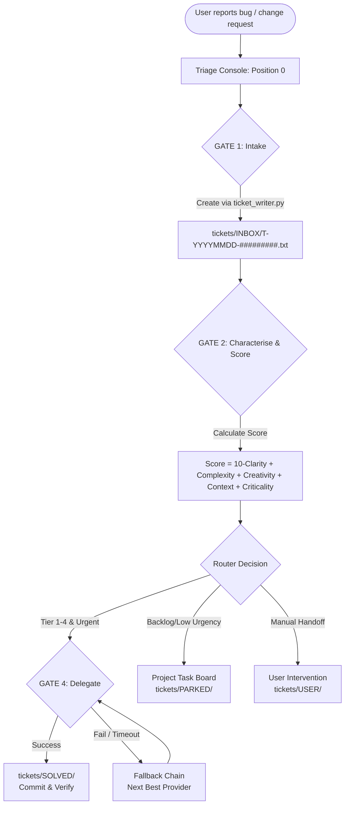

# ticket-master

Ein plattformübergreifender, multi-provider **Workflow / Betriebsmodus** für einen KI-Coding-Agenten.

ticket-master ist ein Workflow/Betriebsmodus für einen KI-Coding-Agenten, kein Tool,
das eigenständig handelt. Du hältst eine Agenten-Session (**„Position 0"**) in deinem
Terminal offen; sobald dir ein Bug, ein Änderungswunsch oder ein Projektproblem
auffällt, tippst du es einfach ein. Indem der Agent diesem Workflow folgt, nimmt er es
als strukturiertes Ticket auf, ordnet es dem richtigen Projekt zu, bewertet es und
routet es — entweder per Delegation an den besten verfügbaren KI-Provider/Subagenten
für einen Sofort-Fix, oder durch Einpflegen ins projekteigene Task-Management, wenn
Delegation nicht sinnvoll ist. Plattformübergreifend (Windows/macOS/Linux),
multi-provider (Claude Code, Codex, agy/Gemini).

[](LICENSE)
[](VERSION)
[](https://github.com/ellmos-ai/ticket-master/actions/workflows/tests.yml)
[](tests/)
[](pyproject.toml)
[](llms.txt)
[](#starter-matrix)
[](https://github.com/ellmos-ai)
[](https://github.com/open-bricks)

---

🇬🇧 [English documentation → README.md](README.md)

> [!NOTE]
> KI-Agenten und RAG-Indexer finden maschinenlesbare Kontextinformationen, Suchbegriffe und Einstiegspunkte in [llms.txt](llms.txt).

**Release-Status:** `v1.12.0` — `VERSION` und `pyproject.toml` melden beide
`1.12.0`; dieses Release ergänzt die optionale `system-auditor`-Brücke
(`lib/auditor_bridge.py`: Spawn/Skip-Verdikt, Sparmodus-Gate,
Findings-zu-Tickets-Dedup) sowie die zuvor unversionierte TM-Kurzsprache/
Boot-Kurzhilfe und das fail-closed Queue-ID-Gate. Es folgt auf den
PEP-639-/SPDX-Metadaten-Patch `v1.11.3`, die nicht mutierende Einzelticket-
`--dry-run`-Vorschau aus `v1.11.2`, das Routing-v2-Release `v1.11.0` und die
mit `v1.10.0` getaggte Auskapselung von TICKET-WRITER/SIG-TU nach
`ellmos-ai/system-auditor`. Eine gesonderte Veröffentlichung (PyPI, npm, …)
wird nicht behauptet.

---

## Wie es funktioniert

ticket-master ist ein **prompt-gesteuerter Workflow**: Der Agent liest den
TICKET-MASTER-Prompt und folgt ihm. Jeder Schritt unten ist etwas, das der *Agent*
tut, indem er dem Prompt folgt — nichts läuft von selbst.

```
You report a bug or change request
        |
        v
[A] Intake — ticket file created, project assigned (GATE1)
        |
        v
[2-5] Characterise → Score → Match provider → Rank 3 candidates (GATE2)
        |
        v
[B] Delegate to best available provider (GATE4 success check + fallback chain)
        |
   or   v
[C] Write to project task management (usage limit / all unavailable)
        |
        v
Position 0 — waiting for next ticket
```



Kernprinzipien (wie der Agent angewiesen wird, sich zu verhalten):

- **Lean Router:** Der Agent bleibt in diesem Modus schlank. Ausführung wird an
  Subagenten delegiert, die kompakt zurückmelden (Commit-Hash + eine Zeile).
- **Companion-Muster:** Für eine Ticket-Serie im gleichen Bereich spawnt der Agent
  einen Companion-Subagenten einmal und verwendet ihn wieder.
- **Score-basiertes Routing:** Der Agent bewertet jedes Ticket auf fünf Dimensionen
  (Klarheit, Komplexität, Kreativität, Kontext, Kritikalität), um den
  benötigten Provider-Tier zu bestimmen.
- **Graceful Fallback:** Wenn der bevorzugte Provider nicht verfügbar ist,
  stellt die Fallback-Kette des Prompts sicher, dass kein Ticket verloren geht.
- **Provider-agnostisch:** Funktioniert mit jedem CLI-basierten LLM-Provider.
  Prompt und Config bringen Unterstützung für Claude, Codex und agy (Gemini) mit.
  Erweiterbar per Config.
- **Cloud-Ready / Multi-System:** Die Ticket-Queue funktioniert auf mehreren
  Maschinen, die einen cloud-synced Ordner (OneDrive, Dropbox, Google Drive) teilen.
  Claims werden per Dateiname-Rename signalisiert — atomar auf NTFS, keine Lock-Dateien
  nötig.

---

## Rollen

<p align="center">
  
  &nbsp;&nbsp;
  
</p>

- **TICKET-MASTER**: Dünner Router und Verkehrsleiter. Verteilt eingehende Tickets ruhig an spezialisierte Subagenten oder Projektaufgaben-Boards.
- **TICKET-WRITER („SIG-TU")**: System Integrity Guardian — **in ein eigenes Modul ausgekapselt.** Siehe unten.

### Aus TICKET-WRITER wurde `system-auditor`

Die Prüfrolle, die früher hier wohnte, hat ein eigenes Zuhause:
**[`ellmos-ai/system-auditor`](https://github.com/ellmos-ai/system-auditor)**.

**Warum sie gegangen ist.** Eine Rolle, die quer über *alle* Policy-, Entscheidungs- und
Gedächtnisspeicher eines Systems liest, ist kein Ticket-Modul — sie hat Tickets nur als
Ausgabekanal benutzt. Der Verlegungs-Vorbehalt in `prompts/TICKET-WRITER.de.md` sagt das
seit dem 2026-07-31 („möglicherweise kein Ticket-Modul, sondern eine eigene Domäne"); damit
ist er aufgelöst.

**Was die Trennung bringt.** Der Auditor hat Fähigkeiten entwickelt, die mit
Ticket-Verwaltung nichts zu tun haben und hier fehl am Platz gewesen wären: Audits tragen
vier Token (Zeitraum, Domäne, System, Auditor), und wer einige festhält und genau einen
variieren lässt, erhält **Meta-Audits** — über Maschinen, über Modelle (Interrater), über
Domänen. Zwei Maschinen, die dieselbe Domäne prüfen, kommen berechtigt zu verschiedenen
Ergebnissen, weil jede ihre eigene Wirklichkeit sieht; genau dieser Unterschied ist das
Produkt, und er braucht einen eigenen Lebenszyklus.

**Was hier bleibt.** Alles rund um Tickets: Format, Kategorien, Lebenszyklus, IDs, Routing.
Der Auditor ist jetzt schlichter **Konsument** — er kennt eine Schnittstelle, „lege eine
Maßnahme an", und bekommt eine Referenz zurück. Er vergibt keine Ticket-IDs und kennt den
Kategorienbaum nicht. Wo kein Ticketsystem installiert ist, schreibt er stattdessen Dateien.

**Migration.** `prompts/TICKET-WRITER.*.md` bleiben vorerst liegen, als abgelöst markiert
und auf den neuen Rollen-Prompt verweisend. Nichts in diesem Repository hängt an ihnen.

### Auditor-Brücke (optional, nur falls `system-auditor` installiert ist)

`lib/auditor_bridge.py` ist eine dünne, opt-in Brücke zum Schwestermodul
[`system-auditor`](https://github.com/ellmos-ai/system-auditor). Sind beide auf einem Host
installiert, kann Schritt **(c6)** des TICKET-MASTER-Prompts beim Sessionstart einen
system-auditor-Lauf spawnen und **betreuen** (zeitgesteuert, standardmäßig aus), ihn
überspringen, solange ein Claude-Code-Sparmodus/Notaus-Stand aktiv ist, und seine
`findings/*.md` in INBOX-Ticket-Entwürfe verwandeln (`--findings-to-tickets`). Ein Codewort
(`audit!` per Default, `auditor_bridge.codeword` in der Config) startet einen Lauf manuell,
unabhängig vom Zeittrigger.

Die Brücke rechnet die eigene Fenster-/Rotations-/Fälligkeitslogik von system-auditor
niemals nach und führt keinen zweiten Zeitstempel-Speicher — `decide()` fragt nur die
installierte CLI und den bestehenden Sparmodus-Hook und kombiniert deren Antworten. Alle
vier Bausteine (`detect_auditor()`/`due_check()`/`spar_gate()`/`findings_to_tickets()`)
sind reine, unabhängig testbare Funktionen; der vollständige Vertrag steht im
Moduldocstring von `lib/auditor_bridge.py` sowie im `auditor_bridge`-Block von
`config/ticket-master.config.example.json`.

```bash
python lib/auditor_bridge.py --check                       # decide()-Verdikt als JSON
python lib/auditor_bridge.py --check --manual               # Codewort-Pfad (umgeht enabled/due)
python lib/auditor_bridge.py --findings-to-tickets          # Trockenlauf: was WÜRDE angelegt
python lib/auditor_bridge.py --findings-to-tickets --apply  # Ticket-Entwürfe wirklich anlegen
```

### Formlose Einreichung (Entscheid 3A)

Eine Datei, die direkt ohne "T-"-Ticketpräfix in `INBOX/` landet, ist ein
**formloser Eintrag**, kein Clutter — `ticket_audit.audit()` meldet ihn unter
`informal_entries`, getrennt von `non_ticket_files`. STARTSEQUENZ-Schritt
**(c7)** formalisiert jeden über `ticket_writer.py --from-file`: setzt einen
Ticketkopf davor, hält den Wortlaut bytegleich in einem
"ORIGINALTEXT"-Block und archiviert die Quelle nach
`INBOX/_formalisiert/` (nie löschen). Idempotent — eine Quelle, die ein
bestehendes Ticket bereits nennt, wird nicht erneut angelegt.

```bash
python lib/ticket_writer.py --from-file tickets/INBOX/notiz.txt --submitter agent-x
python lib/ticket_audit.py tickets --lint   # Pflichtfelder, STATUS-Vokabular, doppelte Blöcke
```

### Boot-Menü Rollen-Spawn (Entscheid 5A)

`lib/boot_menu.py` ist ein reiner Datenhelfer für das Rollen-Spawn-Menü am
Ende der Startsequenz (Schritt (c5)/(c6)) — startet selbst nie einen
Prozess. `--offer` druckt die verfügbaren Rollen, Spawn-Modi (`3:1`/`3:3`/
`2:2`/`1:1`, dazu die Aliase `3 in 1`/`only1`/`only2`/`3x3`), die
Modellliste (aus `clutch models --json`, sonst sichtbarer Fallback auf die
`providers` dieser Config) und den `self_model()` des ticket-master (eine
Harness-Selbstauskunft, sonst `unknown` — nie geraten):

```bash
python lib/boot_menu.py --offer
```

---

## Schnellstart

```bash
# 1. Clone the repository
git clone https://github.com/ellmos-ai/ticket-master.git
cd ticket-master

# 2. Copy and edit the config
cp config/ticket-master.config.example.json config/ticket-master.config.json
# -> Edit config/ticket-master.config.json:
#    - Add your project directories to project_roots[]
#    - Verify provider commands match your installed CLIs

# 3. Launch (default: Claude)
./bin/ticket-master.sh               # Unix/macOS
.\bin\ticket-master.bat              # Windows CMD
.\bin\ticket-master.ps1              # Windows PowerShell
```

Das startet deinen gewählten CLI-Provider mit dem TICKET-MASTER-Prompt der
gewählten Sprache aus `prompts_dir` (Standard:
`prompts/TICKET-MASTER.<lang>.md`, Englisch). Der Agent
liest den Prompt, orientiert sich an deinen Projekten und geht auf **Position 0** —
wartet still auf dein erstes Ticket.

### Prompt-Sprache

Der Agenten-Prompt liegt in zwei vollwertigen, inhaltsgleichen Versionen vor:

- `prompts/TICKET-MASTER.en.md` (Englisch, Standard)
- `prompts/TICKET-MASTER.de.md` (Deutsch)

Die Sprache wird über die Umgebungsvariable `TM_LANG` gewählt; die Starter laden
`prompts/TICKET-MASTER.${TM_LANG}.md` und fallen mit einer Warnung auf Englisch
zurück, falls die angeforderte Datei fehlt. Das Config-Feld `default_language`
dokumentiert den vorgesehenen Standard.

```bash
TM_LANG=de ./bin/ticket-master.sh        # German prompt
TM_LANG=en ./bin/ticket-master.sh        # English prompt (default)
```

```powershell
$env:TM_LANG = "de"; .\bin\ticket-master.ps1
```

---

## Starter-Matrix

| Betriebssystem | Provider | Befehl |
|----------------|----------|--------|
| Unix / macOS | Claude | `./bin/start-claude.sh` oder `./bin/ticket-master.sh --provider claude` |
| Unix / macOS | Codex | `./bin/start-codex.sh` oder `./bin/ticket-master.sh --provider codex` |
| Unix / macOS | agy (Gemini) | `./bin/start-agy.sh` oder `./bin/ticket-master.sh --provider agy` |
| Windows CMD | Claude | `bin\start-claude.bat` oder `bin\ticket-master.bat --provider claude` |
| Windows CMD | Codex | `bin\start-codex.bat` oder `bin\ticket-master.bat --provider codex` |
| Windows CMD | agy (Gemini) | `bin\start-agy.bat` oder `bin\ticket-master.bat --provider agy` |
| Windows PowerShell | Claude | `.\bin\ticket-master.ps1 -Provider claude` |
| Windows PowerShell | Codex | `.\bin\ticket-master.ps1 -Provider codex` |
| Windows PowerShell | agy (Gemini) | `.\bin\ticket-master.ps1 -Provider agy` |

### Umgebungsvariablen

| Variable | Standard | Wirkung |
|----------|----------|---------|
| `TM_PROVIDER` | `claude` | Provider ohne Flag überschreiben |
| `TM_LANG` | `en` | Prompt-Sprache; lädt `prompts_dir/TICKET-MASTER.${TM_LANG}.md` (Fallback `en`) |
| `TM_CONFIG` | `config/ticket-master.config.json` | Optionaler Pfad zur lokalen JSON-Config für den gemeinsamen Resolver |
| `TM_SKIP_PERMISSIONS` | `0` | Auf `1` setzen, um `--dangerously-skip-permissions` an Claude zu übergeben |

---

## Konfiguration

`config/ticket-master.config.example.json` nach
`config/ticket-master.config.json` kopieren (die echte Config ist per
`.gitignore` ausgeschlossen).

### Wichtige Felder

| Feld | Beschreibung |
|------|--------------|
| `tickets_dir` | Bewusst gewählte Live-Queue; der mitgelieferte Baum `./tickets` ist eine schreibgeschützte Fixture, kein Intake-Ziel |
| `prompts_dir` | Repository-lokaler Ordner mit `TICKET-MASTER.<lang>.md`; alle drei Starter lösen ihn über `bin/ticket_master.py` auf und lehnen Pfade außerhalb des Repositorys ab |
| `default_language` | Dokumentierte Standard-Promptsprache (`en`/`de`); Laufzeit-Override via `TM_LANG` |
| `project_roots[]` | **Deine Projekte** — Name, Pfad und Pipeline für jeden Eintrag |
| `providers.claude` | Claude-CLI-Konfiguration (`command`, `default_model`, `args`) |
| `providers.codex` | Codex-CLI-Konfiguration |
| `providers.agy` | Gemini-CLI-Konfiguration |
| `default_provider` | Provider, der ohne explizite Angabe verwendet wird |
| `advisor.enabled` | Advisor-Modell für kritische Tickets (Score ≥ 35) aktivieren |
| `advisor.threshold_score` | Score, ab dem ein Advisor empfohlen wird |
| `score_thresholds` | Tier-Grenzwerte (`tier1_max`, `tier2_max` usw.) — nur Fallback, siehe `router_command` |
| `router_command` | Optional: externer Multi-Modell-/Task-Router, primär vor der Score-Fallback-Formel |
| `task_db_command` | Optional: „später"-Senke für `woche`/`backlog`-Tickets |

### Queue-Root-Identität (Fail Closed)

Ticket-Writer verweigern das Anlegen von `INBOX/` unter einem ungeprüften Pfad.
So kann ein falsches `--tickets-dir` nicht still eine überzeugend aussehende
Parallel-Queue erzeugen. Ein Root wird nur akzeptiert, wenn entweder:

- `.ticket-master-queue` existiert und vollständig den Inhalt
  `ticket-master-queue-v1` trägt; oder
- sowohl `README.md` als auch `_templates/TICKET.txt` eine Ticket-Queue mit
  `INBOX`-/`STATUS:`-Vertrag ausweisen (Kompatibilität für bestehende Queues).

Der Writer darf ein fehlendes `INBOX/` innerhalb dieses verifizierten Roots
anlegen, erzeugt oder errät aber niemals den Queue-Root selbst. Die
Beispielkonfiguration zeigt absichtlich nicht auf die Repository-Fixture.
Schreibe vor dem ersten Intake einmal den exakten Markerwert in das bewusst
gewählte Live-Verzeichnis.

### Beispiel für einen `project_roots`-Eintrag

```json
{
  "name": "my-app",
  "path": "/home/user/projects/my-app",
  "pipeline": "software"
}
```

### Multi-Host-Configs: Platzhalter `<HOME>`/`<USER>`

Liegt `config/ticket-master.config.json` in einem Ordner, der über mehrere
Maschinen synchronisiert wird, löst sich ein wörtlicher Pfad nur auf dem
Host auf, auf dem er geschrieben wurde. `tickets_dir` und jeder
`project_roots[].path` dürfen stattdessen die Platzhalter `<HOME>`
(Home-Verzeichnis des aktuellen Users) und `<USER>` (OS-Username) nutzen —
der Agent, der dem TICKET-MASTER-Prompt folgt, löst diese vor jedem
Datei-Zugriff auf den tatsächlichen Wert des aktuellen Hosts auf. Dieselbe
Konvention wie in `config/ticket-writer.config.example.json`. Beispiel in
`config/ticket-master.config.example.json`.

### Auditierbare CLI (`--list` / `--intake`)

Der gemeinsame Python-Einstiegspunkt hält Ticketübersicht und Intake unter
Windows, macOS und Linux gleich:

```bash
python bin/ticket_master.py --list
python bin/ticket_master.py --list --json
python bin/ticket_master.py --intake "Describe the new issue" --project my-app
```

`--list` gibt deterministische Metadaten `STATUS / ID / TITEL / PFAD` für
offene Tickets in allen v1-Clustern und lesbaren Legacy-Aliasordnern aus; der
Tickettext wird nicht ausgegeben. `--intake` validiert und normalisiert die
Beschreibung, legt exklusiv genau eine unclaimed Datei unter `INBOX/` an und
schreibt nicht in das veraltete gemeinsame Intake-Log. Erst eine tatsächliche
Übergabe an einen Provider/Agent verschiebt das Ticket nach `QUEUED/`. Für
eine explizit verifizierte Live-Queue kann `--tickets-dir`, für eine
JSON-Konfiguration `--config` verwendet werden. Ohne Config kann die Anzeige
die mitgelieferte Repository-Fixture lesen; Intake schlägt dagegen kontrolliert
fehl, bis eine Live-Queue ausdrücklich konfiguriert und verifiziert wurde. Eine
explizit fehlende oder fehlerhafte Config endet mit einem kontrollierten Fehler.

---

## Auffindbarkeit und Abgrenzung

Nutze beim Suchen den kanonischen Namen **`ellmos-ai/ticket-master`**. Dieses
Repository ist ein **LLM-Ticket-Router**: ein prompt-gesteuerter Triage-Workflow,
mit dem eine Coding-Agent-Session Bugs aufnimmt, bewertet, einen Claude-/Codex-/
agy-Provider auswählt und den Ticketverlauf nachvollziehbar hält.

Gute Suchphrasen:

```text
ellmos-ai ticket-master
LLM ticket router agent
AI coding agent triage console
Claude Codex Gemini ticket routing
multi-provider LLM task router
prompt-driven issue intake workflow
companion pattern AI agent workflow
```

Nicht gemeint sind Ticketmaster-Event-APIs, Konzertticket-Bots, Helpdesk-SaaS,
Customer-Support-Tickets, Ticket-Resale-Marktplätze oder ein eigenständiger
Bugtracker, der ohne aktive LLM-Agenten-Session Issues anlegt.

## Wie das Routing funktioniert

### Score-Formel

```
SCORE = (10 - CLARITY) + COMPLEXITY + CREATIVITY + CONTEXT + CRITICALITY
```

Jede Dimension: 0–10. Gesamt: 0–50.

| Score | Tier | Typischer Einsatz |
|-------|------|-------------------|
| 0–8 | Tier 1 | Schnell/günstig — Boilerplate, Formatierung |
| 9–12 | Tier 2 | Standardfähig — Bugs, Dokumentation |
| 13–28 | Tier 3 | Fähiger Coder/Researcher — komplexe Bugs, Code-Review |
| 29–50 | Tier 4 | Architekt/Reviewer — Design, Beweise, kritische Änderungen |

Ab Score ≥ 35 wird ein Advisor-Modell empfohlen.

### Verzeichnisstruktur

```
tickets/
├── _logs/                      <- DEPRECATED shared intake log (pre-1.5.0)
│   └── INTAKE-TRIAGE-LOG.txt
├── _templates/TICKET.txt       <- ticket template
├── *.txt                       <- open tickets (one .txt file each)
├── INBOX/                      <- newly arrived, not yet triaged (root = alias)
├── ACTIONABLE/                 <- actionable now: no blocker, no user dependency
├── QUEUED/                     <- handed to a provider, awaiting result
├── BLOCKED/                    <- external blocker (host-receipt / foreign-state / lock / quota / dependency)
├── WAITING/                    <- time- or marker-bound (scheduled / review-due / marker)
├── USER/                       <- strictly depends on the user (decision / data / freigabe / hardware / session / marker)
├── PARKED/                     <- deliberately set aside (skip / backlog / until-trigger)
├── SOLVED/                     <- resolved and empirically confirmed
├── PENDING/                    <- LEGACY alias (pre-v1) — readable, no new entries
└── .USER/                      <- LEGACY alias (pre-v1) — superseded by USER/
```

Das vollständige Kategorien-Modell (Ein-/Ausgangsregeln, Autonomie-Loop,
STATUS-Spiegelung) steht in [docs/CATEGORIES.de.md](docs/CATEGORIES.de.md)
([English](docs/CATEGORIES.en.md)).
`WAITING/marker` gilt für einen autonom prüfbaren Marker, `USER/marker` wenn
der User diesen Marker liefern oder bestätigen muss.

Der Audit-/Triage-Trail lebt **pro Ticket** in der Ticketdatei selbst
(Felder `STATUS` / `VERLAUF` / `LOESUNG`). Triviale, sofort erledigte und
verifizierte Tickets bekommen eine **minimale** Ticketdatei direkt in
`tickets/SOLVED/`. Das frühere geteilte `tickets/_logs/INTAKE-TRIAGE-LOG.txt`
ist **deprecated**: Wenn mehrere Maschinen an eine cloud-synchronisierte Datei
anhängen, fressen Konfliktkopien Log-Zeilen.

### Cloud-Ready: Multi-System Claim-Konvention

Bei Legacy-Tickets nach Schema v1 in einem cloud-synchronisierten Ordner werden
Claims per **Dateiname** signalisiert; eine getrennte Lock-Datei ist nicht nötig:

| Zustand    | Dateiname-Muster             | Beispiel                         |
|------------|------------------------------|----------------------------------|
| Unclaimed  | `T-YYYYMMDD-#########.txt`         | `T-20260619-483920174.txt`              |
| Claimed    | `T-YYYYMMDD-#########.<HOST>.txt`  | `T-20260619-483920174.WORKSTATION.txt`  |
| Gelöst     | nach `SOLVED/` verschieben   | wie bisher                       |

Jede neue ID enthält eine neunstellige Zufallszahl, die ausschließlich durch
`lib/ticket_writer.py` (direkt oder über `bin/ticket_master.py --intake`)
erzeugt wird. Die Vorlage darf nicht zum manuellen Anlegen kopiert und die
Zahlenkomponente niemals selbst gewählt oder hochgezählt werden; exklusives
lokales Anlegen allein verhindert keine Kollision zweier Hosts, die den
Cloud-Stand des jeweils anderen noch nicht sehen.

**Glob-Muster:** `tickets/INBOX/T-????????-?????????.txt` (unclaimed) ·
`tickets/<CLUSTER>/T-*.LAPTOP.txt` (meine).

Ein Rename im selben Verzeichnis ist auf NTFS und den meisten Cloud-Sync-Implementierungen
atomar. Entsteht eine Konfliktkopie, hat ein System den Claim gewonnen; das andere rollt
zurück und nimmt das nächste unclaimed Ticket.

Lebenszykluswechsel erfolgen fail-closed über `lib/ticket_mover.py`. Mit
`python lib/ticket_mover.py <quelle> <zielordner> --dry-run` lässt sich auch
ein einzelner Move vollständig ohne Mutation vorprüfen; die Ausgabe beginnt
mit `WOULD MOVE`, Quelle und Ziel bleiben unverändert und ein fehlender
Zielordner wird nicht angelegt.

### Routingvertrag v2: Ziel, Ausführung und Claim sind getrennt

Mehrsystemarbeit verwendet eine umlaufende Vertragsakte und keine kopierten
Kindtickets pro Host. Nur Dateien mit `ROUTING_SCHEMA: 2` dürfen die
reservierten v2-Segmente verwenden. Der kanonische Dateiname lautet
`T-ID[.to-<ziel>][.via-<Clutch-Selektor>][.claim-<HOST>].txt`; die Reihenfolge
ist fest und jedes Segment kommt höchstens einmal vor. Die drei Achsen sind
orthogonal:

- `.to-…` ist der unveränderliche Ziel-Snapshot (`any`, `all`, `grouped` oder
  ein exaktes, durch die Systemregistry belegtes System). `.all` wird genau
  einmal beim Erstellen aufgelöst.
- `.via-…` ist eine erforderliche oder bevorzugte Ausführungsbindung.
  ticket-master ruft ausschließlich den öffentlichen Clutch-Resolver auf und
  speichert Fingerprint und Zeitpunkt; eine eigene Modell-, Familien-,
  Runner- oder Aliasliste existiert nicht.
- `.claim-…` ist nur die temporäre Schreiblease. Sie verändert weder Ziel noch
  Ausführungsbindung. Bestehende `T-ID.<HOST>.txt` bleiben undurchsichtige
  Legacy-Claims, auch historische Kombinationen wie `LAPTOP-WORKSTATION-LG`.

Nutzernahe Aliase wie `.all.claude`, `.WORKSTATION-LG.claude-opus` und `.gpt`
werden über die Systemregistry und Clutch in die v2-Grammatik normalisiert. Die
Standardlaufzeit einer Ausführungsbindung beträgt sieben Tage und wird als
absoluter UTC-Zeitpunkt gespeichert; `never` erfordert eine ausdrückliche
Abweichung. Ein Ablauf entfernt nur die Ausführungsbindung vor dem nächsten
erfolgreichen Claim. Er löst kein Ticket, markiert keine Ledger-Zeile als
erledigt und gibt keinen aktiven fremden Claim frei.

Jedes Ziel besitzt genau eine `SYSTEM_LEDGER`-Zeile (`pending`, `claimed`,
`done` oder `blocked`). Receipts erfassen tatsächlichen Runner, Provider,
Modell, Zeitpunkt und Beleg und werden unter Lease idempotent übernommen. Nur
der Inhaber des letzten Claims darf die Akte nach `SOLVED` verschieben, und nur
wenn jede erforderliche Zeile empirisch `done` ist. `ticket_audit.py` meldet
Namens-/Metadaten-, Zielclaim-, Ledger-, Receipt-Signatur- und verfrühte
SOLVED-Verstöße.

Zuständigkeitsgrenze: ticket-master besitzt Vertrag und Lebenszyklus; Clutch
besitzt die Ausführungsauflösung; `.SYNC` transportiert Aufträge und Receipts;
system-gap-master besitzt systemübergreifende Erkennung und Abgleich. Der
ticket-master gibt ausschließlich einen idempotenten `route_intent` mit
Ticket-ID, festem Ziel-Snapshot und Receipt-Ziel aus. Er implementiert keine
Inbox/Outbox, Drop-Zone, Offline-Warteschlange, Retry-Schleife oder
Transportzustände.
Integrationen rufen
`ticket_writer.create_routed_ticket(..., idempotency_key=...)` auf. Eine
Wiederholung desselben normalisierten Auftrags liefert die bestehende Akte;
dieselbe Kennung mit abweichendem Inhalt wird fail-closed abgewiesen.
Lebenszyklusordner bleiben flach: Unterkategorien gehören in `STATUS`, niemals
in Pfade wie `USER/decision`. Der Mover weist solche Ziele vor jeder
Schreibaktion ab; das Audit meldet vorhandene verschachtelte Tickets, ohne sie
zu migrieren. `ticket_audit.py --json` behält dafür die vorhandene Pfadliste
`nested_lifecycle_tickets` und ergänzt pro Fund unter
`nested_lifecycle_details` Quelle, erwartetes flaches Ziel und Zielkollision.

### Companion-Muster

Für eine Reihe zusammengehöriger Tickets startet der Master genau einen
**Companion-Subagenten** und verwendet ihn über `SendMessage` wieder. Der Companion
orientiert sich einmalig (liest Projektdateien und lernt Konventionen) und verarbeitet
danach weitere Tickets ohne wiederholte Orientierungskosten. Bei einem deutlichen
Domänenwechsel oder stark gewachsenem Kontext tauscht der Master den Companion aus.

### Fallback-Kette

```
Candidate 1
    | fail
    v
Candidate 2
    | fail
    v
Candidate 3
    | fail
    v
CHECKPOINT ALPHA:
    1. Async delegation (sync folder / cron)
    2. Project task management (-> BLOCKED/quota or PARKED/backlog)
    3. User handoff (-> USER/session)
```

---

## Personal-Assistant-Ausbau (optional): Domänen-Map, Dringlichkeit & Delegation

Vier optionale Schichten machen aus dem reinen Ticket-Router eine kleine
persönliche Assistenz-Triage-Konsole, aufbauend auf einem BACH-artigen
Personal-Assistant-Install:

- **Domänen-Map (1.6.0, erweitert 1.8.0 und Unreleased):** `lib/domains_generator.py`
  generiert `config/domains.json` — eine Domäne→Experten-Map, gegen eine
  Skill-Registry abgeglichen, um bereits als Standalone-Skill existierende
  Experten zu markieren. Nur zur Generierungszeit wird BACH gebraucht;
  `config/domains.json` selbst ist zur Laufzeit eine reine, BACH-freie
  JSON-Datei. `experts[]` ist NUR Herkunfts-/Gruppierungs-Metadaten — der
  Prompt routet direkt auf den/die aufgelösten Skill(s), nie über den
  Experten als Zwischen-Hop. Seit 1.8.0 erkennt ein Stage-2-Fuzzy-Durchlauf
  (`fuzzy_match_skills()`, plus optional `--extra-skills-dir` als zweiter
  Skill-Bestand) zusätzlich Experten, die eine ganze Skill-FAMILIE regieren
  (`"status": "teilportiert"`, `"matched_skills"`: eine Liste) statt eines
  einzelnen 1:1-portierten Skills. Seit T-20260808-02 erkennt ein Stage-0-Durchlauf
  auf Domänen-Ebene (`match_domain_skill()`) zusätzlich einen Standalone-
  Skill, der einen GANZEN Boss-Agenten ablöst statt eines seiner benannten
  Experten (`"match": "domain"`); ein Boss ohne orchestrierte Experten
  bekommt stattdessen einen synthetischen `"__domain__:<boss>"`-
  Pseudo-Experten, da es sonst keinen Ort gibt, an dem der Treffer hängen
  könnte. Schema: `config/domains.example.json`. Der aktuelle Generator kann
  zusätzlich einen Modulkatalog über `--modules-catalog` und die Frontmatter
  der Skill-Bibliothek über `--skill-library-dir` lesen. Die Herkunftsdaten der
  Skill-Bibliothek sind die primäre exakte Quelle, die alte Registry bleibt
  Fallback, Standalone-Module bilden eine dritte Quelle, und nicht aufgelöste
  Skills mit BACH-Herkunft werden gemeldet statt still einem unpassenden
  Experten zugeordnet.
- **Dringlichkeitsachse (1.7.0):** `config/urgency.json` (Schema:
  `config/urgency.example.json`) ordnet jeder Domäne eine Default-Frist zu
  (`sofort` / `heute` / `woche` / `backlog`) plus Eskalationsregeln (z.B.
  eskaliert veröffentlichte Software + ein schwerer Bug auf `sofort` und
  schickt bei unklarer Schwere zunächst nur einen Diagnose-Subagenten los).
  Diese Achse ist **entkoppelt** vom 5-Dimensionen-Komplexitäts-Score — ein
  Ticket kann niedrigen Score haben und trotzdem dringend sein, oder
  umgekehrt. Grenzfälle können optional einen konfigurierten
  Präferenz-Hinweis konsultieren (`preference_model_hint.command`); niedrige
  Konfidenz bedeutet immer: den User fragen statt raten.
- **Delegations-Verdrahtung (1.7.0, erweitert 1.8.0):** Das Intake-Gate des
  Prompts löst für eine getroffene Domäne einen `ENDPOINT` auf (über
  `domains.json`, dann optionale Skill-Registry-Tools, dann eine LÜCKEN-
  Markierung statt stillem Fallback); die Modellwahl bevorzugt einen
  optionalen externen `router_command` vor der eingebauten Score-Formel-
  Fallback-Logik; eine Rechteprüfung gegen `LOCK*.txt`-/
  `LOCK.permissions.json`-artige Konventionen läuft vor jedem Worker-Spawn;
  und Tickets mit Dringlichkeit `woche`/`backlog` werden an eine optionale
  „später"-Senke (`task_db_command`) übergeben, statt einen Subagenten zu
  spawnen. Seit 1.8.0 bekommt der Worker bei `"teilportiert"` ALLE Skills
  aus `matched_skills` mit, nicht nur den ersten — ein Experte kann eine
  ganze Skill-Familie regieren (siehe Domänen-Map-Abschnitt oben).
- **Wissens-Schicht (1.9.0):** `config/knowledge.json` (Schema:
  `config/knowledge.example.json`) listet Wissensquellen in vier
  Kategorien — `maps` (strukturell, beim Boot geladen), `state` (ändert
  sich während der Session, vor jeder Routing-Entscheidung neu geprüft),
  `capabilities` (bei Endpunkt-/Modell-Lookup konsultiert) und `user_model`
  (Präferenz-Hinweis, nur bei echten Grenzfällen). Grundregel: generierten
  Karten vertrauen, nicht dem Gedächtnis — bei Widerspruch die Karte neu
  generieren lassen statt der Erinnerung zu vertrauen.

Details siehe `CHANGELOG.md` (1.6.0–1.9.0 und Unreleased).

---

## Voraussetzungen

- Mindestens ein CLI-basierter LLM-Provider (`claude`, `codex` oder `agy`)
- Python 3.10+ (für gemeinsamen Starter/CLI, Generatoren, Helfer und Tests)
- Keine zusätzlichen Python-Abhängigkeiten

### Provider-Installation

| Provider | Installation |
|----------|--------------|
| Claude CLI | `npm install -g @anthropic-ai/claude-code` |
| Codex CLI | `npm install -g @openai/codex` |
| agy (Gemini) | Siehe [Antigravity-Dokumentation](https://github.com/google-labs-git/agy) |

---

## Smoke-Tests ausführen

```bash
python tests/test_smoke.py
```

Prüft: Verzeichnisstruktur vollständig, Config-JSON valide, Prompt enthält
keine verbotenen absoluten Pfade oder systemspezifischen Begriffe und — in
einem Git-Checkout — lokale Datenschutzartefakte bleiben durch `.gitignore`
abgedeckt.

---

## Teil der ellmos-Stack-Familie

ticket-master ist bewusst beides: ein eigenständiges Dev-Tool und ein Kernmodul
der ellmos-Stack-Familie.

Kernmodul von [ellmos-ai/agent-ops-stack](https://github.com/ellmos-ai/agent-ops-stack)
(Rolle `ticket-routing`); Familie/Katalog: [ellmos-ai/stacks](https://github.com/ellmos-ai/stacks);
Org-Übersicht: [ellmos-ai](https://github.com/ellmos-ai).

## Ökosystem & Geschwisterwerkzeuge

Teil der [ellmos-ai](https://github.com/ellmos-ai) Multi-Agenten-Infrastruktur und des übergeordneten [open-bricks](https://github.com/open-bricks) Open-Source-Software-Ökosystems:

| Werkzeug | Organisation | Beschreibung |
|----------|--------------|--------------|
| [clutch](https://github.com/ellmos-ai/clutch) | ellmos-ai | Adaptiver Multi-Modell-LLM-Router & Agent-Execution-Gear |
| [coma](https://github.com/ellmos-ai/coma) | ellmos-ai | Single-Binary Multi-Agent-Orchestrator & Koordinations-Engine |
| [swarm-ai](https://github.com/ellmos-ai/swarm-ai) | ellmos-ai | Schwarmintelligenz und autonome Agenten-Konsens-Engine |
| [system-explorer](https://github.com/ellmos-ai/system-explorer) | ellmos-ai | Lokale Systemerkennung und Hardware-Ressourcen-Monitor |
| [policy-registry](https://github.com/ellmos-ai/policy-registry) | ellmos-ai | Einheitliche Agenten-Rechte- und Policy-Management-Engine |
| [sqlite-transit-sync](https://github.com/ellmos-ai/sqlite-transit-sync) | ellmos-ai | Multi-Agent-State-Synchronisation über SQLite-WAL-Journale |
| [workflowhooker](https://github.com/ellmos-ai/workflowhooker) | ellmos-ai | Event-Hooks und Agenten-Workflow-Automatisierungs-Trigger |
| [memoryhooker](https://github.com/ellmos-ai/memoryhooker) | ellmos-ai | Transparentes SQLite/FTS5 Arbeitsgedächtnis für Agenten |
| [DevCenter](https://github.com/dev-bricks/DevCenter) | dev-bricks | Entwickler-Control-Plane, Repository-Dashboard & Umgebungsmanager |
| [CodeBox](https://github.com/dev-bricks/CodeBox) | dev-bricks | Polyglotter Code-Snippet-Manager & Entwickler-Werkbank |
| [safe-start-for-codex](https://github.com/dev-bricks/safe-start-for-codex) | dev-bricks | Sicherer Starter und Rechte-Isolator für Codex CLI Sessions |
| [automation-master](https://github.com/dev-bricks/automation-master) | dev-bricks | Automations-Orchestrierung und lokaler Job-Scheduler |

---

## Haftung / Liability

Dieses Projekt ist eine **unentgeltliche Open-Source-Schenkung** im Sinne der §§ 516 ff. BGB. Die Haftung des Urhebers ist gemäß **§ 521 BGB** auf **Vorsatz und grobe Fahrlässigkeit** beschränkt. Ergänzend gelten die Haftungsausschlüsse der MIT-Lizenz.

Nutzung auf eigenes Risiko. Keine Wartungszusage, keine Verfügbarkeitsgarantie, keine Gewähr für Fehlerfreiheit oder Eignung für einen bestimmten Zweck.

This project is an unpaid open-source donation. Liability is limited to intent and gross negligence (§ 521 German Civil Code). Use at your own risk. No warranty, no maintenance guarantee, no fitness-for-purpose assumed.

---

## Lizenz

MIT License — Copyright (c) 2026 Lukas Geiger. Siehe [LICENSE](LICENSE).

## Autor

Lukas Geiger ([github.com/lukisch](https://github.com/lukisch))
