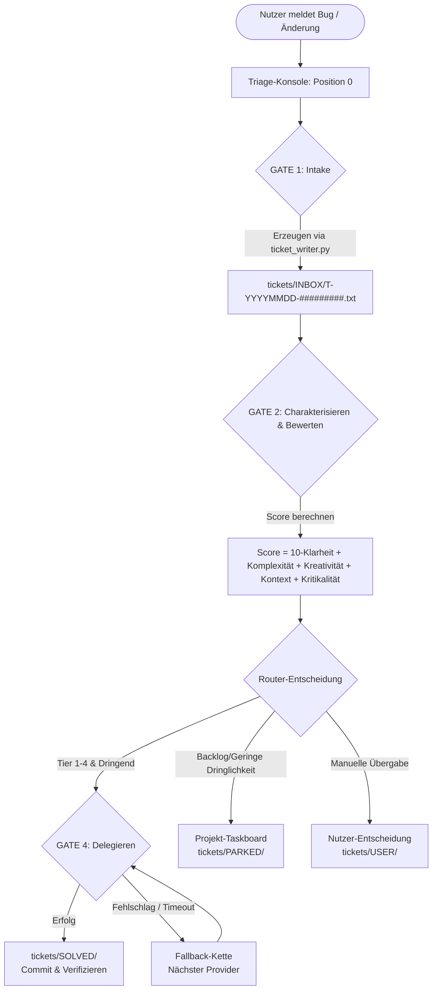

# ticket-master

Ein plattformübergreifender, multi-provider **Workflow / Betriebsmodus** für einen KI-Coding-Agenten.

ticket-master ist ein Workflow/Betriebsmodus für einen KI-Coding-Agenten, kein Tool,
das eigenständig handelt. Du hältst eine Agenten-Session (**„Position 0"**) in deinem
Terminal offen; sobald dir ein Bug, ein Änderungswunsch oder ein Projektproblem
auffällt, tippst du es einfach ein. Indem der Agent diesem Workflow folgt, nimmt er es
als strukturiertes Ticket auf, ordnet es dem richtigen Projekt zu, bewertet es und
routet es — entweder per Delegation an den besten verfügbaren KI-Provider/Subagenten
für einen Sofort-Fix, oder durch Einpflegen ins projekteigene Task-Management, wenn
Delegation nicht sinnvoll ist. Plattformübergreifend (Windows/macOS/Linux),
multi-provider (Claude Code, Codex, agy/Gemini).

[](LICENSE)
[](NOTICE)
[](VERSION)
[](https://github.com/ellmos-ai/ticket-master/actions/workflows/tests.yml)
[](tests/)
[](pyproject.toml)
[](#sec-05)
[](SECURITY.md)
[](SECURITY.md)
[](THIRD_PARTY_LICENSES.md)
[](MARKETING-LOG.txt)
[](MARKETING-LOG.txt)
[](MARKETING-LOG.txt)
[](llms.txt)
[](#sec-09)
[](https://github.com/ellmos-ai)
[](https://github.com/open-bricks)

---

🇬🇧 [English documentation → README.md](README.md)

> [!NOTE]
> KI-Agenten und RAG-Indexer finden maschinenlesbare Kontextinformationen, Suchbegriffe und Einstiegspunkte in [llms.txt](llms.txt).

**Release-Status:** `v1.12.0` — `VERSION` und `pyproject.toml` melden beide `1.12.0`; dieses Release ergänzt die optionale `system-auditor`-Brücke (`lib/auditor_bridge.py`: Spawn/Skip-Verdikt, Sparmodus-Gate, Findings-zu-Tickets-Dedup) sowie die zuvor unversionierte TM-Kurzsprache/Boot-Kurzhilfe und das fail-closed Queue-ID-Gate. Es folgt auf den PEP-639-/SPDX-Metadaten-Patch `v1.11.3`, die nicht mutierende Einzelticket-`--dry-run`-Vorschau aus `v1.11.2`, das Routing-v2-Release `v1.11.0` und die mit `v1.10.0` getaggte Auskapselung von TICKET-WRITER/SIG-TU nach `ellmos-ai/system-auditor`. Eine gesonderte Veröffentlichung (PyPI, npm, …) wird nicht behauptet.

---

## Schnellnavigation

1. [Überblick](#1-overview)
2. [Kernfunktionen](#2-key-capabilities)
3. [Zielgruppen & Auffindbarkeit](#3-target-personas--discoverability)
4. [Vergleichsmatrix gegenüber Alternativen](#4-comparative-matrix-vs-alternatives)
5. [Governance & Laufzeit-Invarianten](#5-governance--runtime-invariants)
6. [Architektur & Routing-Ablauf](#6-architecture--routing-flow)
7. [Rollen & Auditor-Brücke](#7-roles--auditor-bridge)
8. [Formlose Einreichung & Boot-Menü](#8-informal-intake--boot-menu)
9. [Schnellstart & Starter](#9-quick-start--starters)
10. [Konfiguration & Multi-Host](#10-configuration--multi-host)
11. [Routingvertrag v2 & Score-Formel](#11-routing-contract-v2--score-formula)
12. [Cloud-Ready Multi-System Claim-Konvention](#12-cloud-ready-multi-system-claim-convention)
13. [Personal-Assistant-Ausbau & Delegation](#13-personal-assistant-expansion--delegation)
14. [Test-Suite & Verifikations-Gates](#14-test-suite--verification-gates)
15. [Ökosystem & Geschwisterwerkzeuge](#15-ecosystem--sibling-tools)
16. [Drittanbieter-Lizenzen & Transparenz](#16-third-party-licenses--transparency)
17. [Sicherheitsrichtlinie & SLA](#17-security-policy--sla)
18. [Lizenz & Maintainer](#18-license--maintainers)

---

<a id="sec-01"></a>
<a id="1-overview"></a>
<a id="1-ueberblick"></a>
<a id="ueberblick"></a>
## 1. Überblick

`ticket-master` ist ein prompt-gesteuerter Workflow und Betriebsmodus, der eine aktive KI-Coding-Agenten-Sitzung in eine strukturierte, verlässliche **Position-0-Triage-Konsole** verwandelt. Anstatt als intransparenter, autonomer Hintergrunddienst zu agieren, stattet `ticket-master` den Agenten im Terminal mit systematischen Aufnahme-, Bewertungs-, Zuweisungs- und Routing-Fähigkeiten über den gesamten lokalen Repository-Bestand aus.

Fällt während der Softwareentwicklung ein Bug, ein Refactoring-Bedarf oder eine Feature-Idee auf, wird diese formlos in die geöffnete Sitzung eingetippt. Der Agent strukturiert die Meldung in ein auditiertes Ticket, bewertet die Komplexität über fünf Dimensionen und delegiert die Aufgabe deterministisch an die am besten geeignete Provider-CLI (wie Claude Code, OpenAI Codex oder agy/Gemini) oder pflegt sie in das lokale Taskboard des Zielprojekts ein, falls Kontingente oder Prioritäten einen Aufschub erfordern.

Das System folgt einer strikten Local-First-Philosophie: Sämtliche Warteschlangen, Tickets, Lebenszyklusordner und Audit-Logs verbleiben direkt auf dem lokalen Dateisystem. Die Koordination zwischen mehreren Entwicklungsrechnern erfolgt nahtlos über cloud-synchronisierten Speicher mittels atomarer Datei-Umbenennungen – ohne Datenbankserver, Cloud-Locks oder Hintergrund-Daemons.

---

<a id="sec-02"></a>
<a id="2-key-capabilities"></a>
<a id="2-kernfunktionen"></a>
<a id="kernfunktionen"></a>
## 2. Kernfunktionen

| Kernfunktion | Beschreibung |
|---|---|
| **Schlanke Router-Architektur** | Hält den primären Triage-Agenten reaktionsschnell und schlank; die Code-Ausführung wird an Sub-Agenten delegiert, die kompakt Bericht erstatten. |
| **Score-basiertes 5D-Routing** | Bewertet jedes Ticket über Klarheit, Komplexität, Kreativität, Kontext und Kritikalität zur Bestimmung der passenden Provider-Stufe (Tiers 1–4). |
| **Token-sparendes Companion-Muster** | Fasst Tickets derselben Domäne in einem dedizierten Companion-Subagenten zusammen; Orientierungskosten fallen nur einmalig an. |
| **Atomare Multi-System-Claims** | Multi-Host-sicheres Claim-Verfahren (`.claim-<host>-<ts>`) über atomare Dateisystem-Renames; 0 Datenbank-Abhängigkeiten, 0 Sync-Konflikte. |
| **Deterministische Fallback-Ketten** | Mehrstufig konfigurierte Fallbacks garantieren, dass Aufgaben auch bei Provider-Ausfällen oder Rate-Limits nicht verloren gehen. |
| **Formloser Intake & Formalisierung** | Automatische Erfassung formloser Notizen in `INBOX/` mit zeichengetreuer Aufbewahrung im `ORIGINALTEXT`-Block und sicherer Archivierung. |
| **Auditor-Brücke & Sparmodus-Gate** | Nahtlose Schnittstelle zu `ellmos-ai/system-auditor`; wandelt Prüfbefunde fehlersicher unter Beachtung aktiver Token-Sparstufen in Entwurfstickets um. |
| **0 externe Laufzeit-Abhängigkeiten** | Der Kern läuft vollständig auf der reinen Python-Standardbibliothek (`dependencies = []`); maximale Portabilität und Langlebigkeit. |
| **Unprivilegierte Ausführung** | Läuft standardmäßig im Benutzermodus (`RunAsInvoker`) ohne Administratorrechte, Root-Zugriff oder UAC-Prompts. |

---

<a id="sec-03"></a>
<a id="3-target-personas--discoverability"></a>
<a id="3-zielgruppen--auffindbarkeit"></a>
<a id="zielgruppen--auffindbarkeit"></a>
## 3. Zielgruppen & Auffindbarkeit

`ticket-master` löst Aufgaben-Orchestrierungs-, Triage- und Delegationsherausforderungen für vier primäre Entwickler-Zielgruppen:

| Persona-ID | Zielgruppe | Primärer Bedarf | ticket-master Lösungsarchitektur |
|---|---|---|---|
| `[PERSONA-01]` | **Autonome KI-Coding-Agent-Engineers & Schwarm-Operatoren** | Deterministisches, strukturiertes und token-effizientes Routing von Programmieraufgaben an spezialisierte CLI-Agenten ohne manuelle Kontextübergabe. | „Position 0"-Triage-Konsole, 5-Dimensionen-Scoring (`10 - Clarity + Complexity + Creativity + Context + Criticality`), kompaktes Rückgabeprotokoll und Companion-Wiederverwendung. |
| `[PERSONA-02]` | **Multi-Host & DevOps Automation Engineers** | Serverlose, plattformübergreifende Task-Queue-Verwaltung auf Windows, macOS und Linux ohne fragile Cloud-Lockouts oder Message-Broker. | Cloud-fähige Queue mit atomaren Dateinamen-Claims (`.claim-<host>-<ts>`), 0 externe Broker/Server und fail-closed Queue-Root-Prüfung. |
| `[PERSONA-03]` | **Solo-Entwickler, Maintainer & CLI-Power-User** | Nahtlose Erfassung von Bug-Meldungen und Feature-Gedanken direkt aus dem Terminal ohne Unterbrechung des aktiven Programmierflusses. | Prompt-gesteuerte formlose Notizaufnahme (`--from-file`), byte-identische Erhaltung des Originaltexts in `ORIGINALTEXT` und saubere Projekt-Taskboard-Ablage. |
| `[PERSONA-04]` | **Enterprise AI Safety, Governance & Compliance Officers** | Transparente, lokale Ausführungsgrenzen ohne Datenabfluss, lückenlose Ticket-Historie und verbindliche Lizenz- und Sicherheitszusagen. | 100% Offline-Architektur ohne Netzwerk-Egress, unprivilegierter `RunAsInvoker`-Benutzermodus, 0 Laufzeit-Abhängigkeiten und 48-Stunden Sicherheits-SLA. |

### High-Intent Suchbegriffe

Zur schnellen Auffindbarkeit in Entwickler-Verzeichnissen, Paketmanagern und Dokumentationssystemen:
- `plattformübergreifender Multi-Provider LLM Task-Router für KI-Coding-Agenten`
- `KI-Agenten Triage-Konsole für Claude Codex und Gemini`
- `score-basiertes Prompt-gesteuertes Ticket-Routing für autonome Agenten`
- `cloud-synchronisierte Multi-Host Agenten-Queue mit atomarem Claim-Rename`
- `lokale Zero-Egress Aufgabenverwaltung und Triage für Software-Projekte`
- `Companion-Muster Wiederverwendung von Sub-Agenten zur Token-Ersparnis`
- `formlose Ticketerfassung und automatische Formalisierung per CLI`
- `reine Python Standardbibliothek Task-Router ohne externe Abhängigkeiten`

---

<a id="sec-04"></a>
<a id="4-comparative-matrix-vs-alternatives"></a>
<a id="4-vergleichsmatrix-gegenueber-alternativen"></a>
<a id="vergleichsmatrix-gegenueber-alternativen"></a>
## 4. Vergleichsmatrix gegenüber Alternativen

Die folgende Matrix vergleicht `ticket-master` mit bestehenden Issue-Trackern, Agenten-Plattformen und Task-Queues anhand von 10 technischen Dimensionen, die direkt auf unsere Governance-Invarianten abgestimmt sind:

| Technische Dimension | Governance-Invariante | ticket-master | Traditionelle Issue-Tracker (Jira / Linear / GitHub) | Cloud-KI-Agenten-Plattformen (CrewAI / AutoGPT) | Ad-Hoc Chatbot-Fenster (ChatGPT / Claude Web) | Verteilte Task-Queues (Celery / RabbitMQ) |
|:---|:---:|:---:|:---:|:---:|:---:|:---:|
| **1. Offline-First & Zero Egress** | `INV-LOCAL-01` | **100% Lokal (Lokale Platte, 0 Telemetrie)** | Niedrig (Zwingendes SaaS/Cloud-Lock-in) | Niedrig (Zentrale Cloud-Telemetrie) | Niedrig (Proprietäre Cloud-Server) | Hoch (Self-hosted) / Niedrig (Cloud) |
| **2. Prompt-Driven Agent Native** | `INV-WORKFLOW-02` | **Position-0-Agenten-Betriebsmodus** | Keine (Statische Web-Formulare/APIs) | Teilweise (Intransparente Daemon-Schleifen) | Gering (Manuelles Copy-Paste im Chat) | Keine (Reine Programmier-APIs/Worker) |
| **3. Score-Basiertes 5D-Routing** | `INV-ROUTING-03` | **Deterministisches 5-Dimensionen-Scoring** | Keine (Manuelle Prioritäts-Labels) | Unvorhersehbar (Ad-Hoc LLM-Routing) | Keine (Nutzer wählt Modell manuell) | Basis (Ganzzahlige Prioritäten/Queues) |
| **4. Atomare Multi-System-Claims** | `INV-CLAIM-04` | **Atomarer Datei-Rename (`.claim-…`)** | DB-Zeilensperren / SaaS-API | Cloud-DB-Sperren / Redis | Keine (Manueller Einzelnutzer) | Broker-verwaltete Consumer-Locks |
| **5. Token-sparendes Companion-Muster** | `INV-COMPANION-05` | **Wiederverwendbare Domänen-Begleiter** | Keine | Gering (Voller Kontext pro Task gesendet) | Keine (Manuelle Neuorientierung) | Keine |
| **6. Formloser Intake & Formalisierung** | `INV-INTAKE-06` | **Byte-erhaltend (`--from-file`)** | Keine (Weist Freitext-Dateien ab) | Gering (Unstrukturierte Prompt-Dumps) | Hoch (Akzeptiert Freitext, kein Schema) | Keine (Erfordert striktes Schema) |
| **7. Auditor-Brücke & Sparmodus** | `INV-AUDITOR-07` | **Fail-Closed Token-Budget-Gate** | Keine | Keine | Keine | Keine |
| **8. Unprivilegierte Ausführung** | `INV-UNPRIV-08` | **Strikter RunAsInvoker (Benutzermodus)** | Entfällt (Webanwendung) | Erfordert oft privilegierte Docker-Rechte | Entfällt (Browser) | Erfordert oft Systemdienst-Rechte |
| **9. 0 Pflicht-Abhängigkeiten** | `INV-PORTABLE-09` | **Reine Python-Standardbibliothek (`[]`)** | Schwere Web-Stacks | Umfangreiche Abhängigkeitsbäume | Entfällt | Schwere Broker-Pakete (Erlang, Redis) |
| **10. Sicherheits-SLA & Multi-OS CI** | `INV-SLA-10` | **48h SLA / Windows & Linux Matrix** | Enterprise-Hersteller-SLA | Community / Inaktiv | Proprietäre AGB-Bedingungen | Open-Source-Community |

---

<a id="sec-05"></a>
<a id="5-governance--runtime-invariants"></a>
<a id="5-governance--laufzeit-invarianten"></a>
<a id="governance--laufzeit-invarianten"></a>
## 5. Governance & Laufzeit-Invarianten

`ticket-master` wird nach zehn unverhandelbaren Governance- und Laufzeit-Invarianten entwickelt und betrieben:

- **`INV-LOCAL-01` (100% Offline & Local-First Zero-Egress):** Sämtliche Tickets, Lebenszyklus-Ordner (`INBOX`, `ACTIONABLE`, `QUEUED`, `BLOCKED`, `WAITING`, `USER`, `PARKED`, `PENDING`, `SOLVED`), Konfigurationen und Audit-Logs verbleiben ausnahmslos auf dem lokalen Dateisystem oder nutzergesteuerten Cloud-Sync-Verzeichnissen. Keine externen Netzwerkaufrufe, keine Telemetrie, kein Datenabfluss.
- **`INV-WORKFLOW-02` (Prompt-Driven Agent-Native Workflow):** `ticket-master` fungiert als transparenter Arbeitsmodus („Position 0") für KI-Coding-Agenten. Der Agent führt die Schritte anhand strukturierter Prompts aus; keine intransparenten Hintergrund-Daemons übernehmen unüberwachte Eigenaktionen.
- **`INV-ROUTING-03` (Score-Based 5-Dimension Routing):** Jedes Ticket wird objektiv nach fünf Dimensionen bewertet: Klarheit, Komplexität, Kreativität, Kontext und Kritikalität. Das Routing erfolgt anhand von Provider-Fähigkeitsstufen mit deterministischen Fallback-Ketten.
- **`INV-CLAIM-04` (Atomic Multi-System Claim Convention):** Die Koordination zwischen mehreren Entwicklungsknoten basiert ausschließlich auf atomaren Dateisystem-Renames (`.claim-<host>-<ts>`). Keine Datenbankserver, keine Lock-Dateien, keine Cloud-Sync-Blockaden.
- **`INV-COMPANION-05` (Token-Saving Companion Pattern):** Bei Ticket-Serien derselben Domäne wird ein Companion-Subagent gestartet und wiederverwendet. Dadurch fallen Orientierungskosten nur einmal an, was den Token-Verbrauch drastisch reduziert.
- **`INV-INTAKE-06` (Informal Intake & Byte-Preserving Formalization):** Formlose Notizen in `INBOX/` werden durch `ticket_writer.py --from-file` idempotent mit einem Ticket-Header versehen, im `ORIGINALTEXT`-Block zeichengetreu bewahrt und nach `INBOX/_formalisiert/` verschoben, ohne Originale zu löschen.
- **`INV-AUDITOR-07` (Auditor Bridge & Fail-Closed Sparmodus Gate):** Die Brücke zu `ellmos-ai/system-auditor` respektiert aktive Token-Sparmodus-Stufen (`spar_gate`), verhindert unnötige Läufe und wandelt Befunde mit automatischer Deduplizierung in Entwurfstickets um.
- **`INV-UNPRIV-08` (Unprivileged User-Mode Operation — `RunAsInvoker`):** Alle Werkzeuge, Starter und Skripte laufen mit normalen Benutzerrechten ohne UAC-Elevation, Root-Rechte oder administrative Privilegien.
- **`INV-PORTABLE-09` (Zero Mandatory Runtime Dependencies):** Kern und Kommandozeilenwerkzeuge nutzen ausschließlich die Python-Standardbibliothek (`dependencies = []`). Optionale Extras wie `clutch-router` sind sauber isoliert.
- **`INV-SLA-10` (Open-Source Governance & 48h Security SLA):** Freie MIT-Lizenz, offene PEP 621/639 Metadaten, Multi-OS CI-Matrix (Ubuntu, Windows) auf Python 3.10–3.13 und ein verbindliches 48-Stunden-Sicherheits-Reaktionsfenster.

---

<a id="sec-06"></a>
<a id="6-architecture--routing-flow"></a>
<a id="6-architektur--routing-ablauf"></a>
<a id="architektur--routing-ablauf"></a>
## 6. Architektur & Routing-Ablauf

ticket-master ist ein **prompt-gesteuerter Workflow**: Der Agent liest den
TICKET-MASTER-Prompt und folgt ihm. Jeder Schritt unten ist etwas, das der *Agent*
tut, indem er dem Prompt folgt — nichts läuft von selbst.

```
You report a bug or change request
        |
        v
[A] Intake — ticket file created, project assigned (GATE1)
        |
        v
[2-5] Characterise → Score → Match provider → Rank 3 candidates (GATE2)
        |
        v
[B] Delegate to best available provider (GATE4 success check + fallback chain)
        |
   or   v
[C] Write to project task management (usage limit / all unavailable)
        |
        v
Position 0 — waiting for next ticket
```



---

<a id="sec-07"></a>
<a id="7-roles--auditor-bridge"></a>
<a id="7-rollen--auditor-bruecke"></a>
<a id="rollen--auditor-bruecke"></a>
## 7. Rollen & Auditor-Brücke

<p align="center">
  
  &nbsp;&nbsp;
  
</p>

- **TICKET-MASTER**: Schlanker Verkehrsrouter & Dispatcher. Verteilt eingehende Tickets ruhig an Worker-Subagenten oder das projektbezogene Task-Management.
- **TICKET-WRITER („SIG-TU")**: Wächter über Systemintegrität — **ausgekapselt in ein eigenes Modul.** Siehe unten.

### TICKET-WRITER ist jetzt `system-auditor`

Die hier früher enthaltene Audit-Rolle hat ihr eigenes Zuhause:
**[`ellmos-ai/system-auditor`](https://github.com/ellmos-ai/system-auditor)**.

**Warum die Auskapselung?** Eine Rolle, die über *alle* Richtlinien-, Entscheidungs- und Speicherstände eines Systems liest, ist kein Ticket-Modul — Tickets waren für sie nur der Ausgabekanal. Der Auskapselungs-Hinweis in `prompts/TICKET-WRITER.de.md` hielt dies seit 2026-07-31 fest („womöglich kein Ticket-Modul, sondern eine eigene Domäne").

**Was bringt die Trennung?** Der Auditor hat Fähigkeiten entwickelt, die mit Ticket-Handling nichts zu tun haben: Audits tragen vier Dimensionen (Periode, Domäne, System, Auditor). Werden einige fixiert und andere variiert, entstehen **Meta-Audits** — rechnerübergreifend, modellübergreifend (Interrater) und domänenübergreifend. Zwei Rechner, die dieselbe Domäne prüfen, dürfen berechtigt unterschiedliche Befunde liefern; diese Differenz ist das Erkenntnisprodukt und benötigt einen eigenen Lebenszyklus.

**Was bleibt hier?** Alles rund um Tickets: Format, Kategorien, Lebenszyklus, IDs, Routing. Der Auditor ist heute ein reiner **Konsument** — er kennt eine Schnittstelle („Maßnahme erfassen") und erhält eine Referenz zurück.

**Migration:** `prompts/TICKET-WRITER.*.md` bleiben vorerst als historische Nachweise erhalten, als überholt markiert und mit Verweis auf den neuen Rollen-Prompt. Nichts in diesem Repository hängt mehr von ihnen ab.

### Auditor-Brücke (optional, wenn `system-auditor` installiert ist)

`lib/auditor_bridge.py` ist eine schlanke, opt-in Brücke zum Schwestermodul [`system-auditor`](https://github.com/ellmos-ai/system-auditor). Sind beide auf einem Host installiert, kann Schritt **(c6)** des TICKET-MASTER-Prompts beim Start der Sitzung einen System-Auditor-Lauf anstoßen und *überwachen* (zeitgesteuert, standardmäßig aus), ihn überspringen, solange eine Claude-Code-Sparmodus-/Notaus-Stufe aktiv ist, und seine `findings/*.md` in Entwurfstickets in `INBOX/` überführen (`--findings-to-tickets`). Ein Codewort (standardmäßig `audit!`, konfigurierbar über `auditor_bridge.codeword`) löst den Lauf jederzeit manuell aus.

Die Brücke berechnet system-auditor's eigene Intervall- und Rotationslogik nicht nach und führt keinen zweiten Zeitstempel-Speicher — `decide()` befragt lediglich die installierte CLI sowie den Sparmodus-Hook und verknüpft deren Antworten. Alle vier Bausteine (`detect_auditor()`/`due_check()`/`spar_gate()`/`findings_to_tickets()`) sind unabhängige, testbare Funktionen.

```bash
python lib/auditor_bridge.py --check                       # decide()-Ergebnis als JSON
python lib/auditor_bridge.py --check --manual               # Codewort-Pfad (ignoriert due/enabled)
python lib/auditor_bridge.py --findings-to-tickets          # Dry-Run: was WÜRDE angelegt werden
python lib/auditor_bridge.py --findings-to-tickets --apply  # Entwurfstickets tatsächlich anlegen
```

### Kommentierung, Nachträge und aktueller Readback

Jede neue Zeile in `VERLAUF / LOG` folgt dem Format
`YYYY-MM-DD | akteur@host | Aussage — Beleg`. Zustandsaussagen wie **Status**,
**Sperre**, **Hold** oder **abgeschlossen** brauchen einen konkreten Mess- oder
Readback-Beleg. `lib/ticket_audit.py --lint` meldet fehlendes Datum, fehlenden
Akteur und unbelegte Zustandswörter; historische Zeilen werden dabei nicht
überschrieben.

Wenn ein älterer Eintrag nicht mehr gilt, bleibt er am Fundort erhalten und
wird durch einen datierten `NACHTRAG`- oder `SUPERSEDED`-Block mit Ticket,
Akteur und Beleg fortgeschrieben. Ein aktuelles STATUS-Feld allein ersetzt
keinen Readback des zugrunde liegenden Zustands.

---

<a id="sec-08"></a>
<a id="8-informal-intake--boot-menu"></a>
<a id="8-formlose-einreichung--boot-menue"></a>
<a id="formlose-einreichung--boot-menue"></a>
## 8. Formlose Einreichung & Boot-Menü

### Formlose Einreichung (Entscheid 3A)

Eine Datei, die ohne das `T-`-Präfix direkt in `INBOX/` abgelegt wird, ist ein **formloser Eintrag**, kein Müll — `ticket_audit.audit()` führt sie unter `informal_entries`, getrennt von `non_ticket_files`. STARTUP SEQUENCE Schritt **(c7)** formalisiert jede davon über `ticket_writer.py --from-file`: Sie erhält einen Ticket-Header, behält den exakten Wortlaut in einem „ORIGINALTEXT"-Block und wird nach `INBOX/_formalisiert/` verschoben (nie gelöscht). Idempotent — Quellen, die bereits in einem bestehenden Ticket referenziert sind, werden nicht erneut verarbeitet. `--from-file` und `--split-from` können nicht mit Routing-Flags kombiniert werden; ein solcher Aufruf bricht mit einem kontrollierten Fehler ab, da Routing- und Vertragsmetadaten über `--title`/`--body` angelegt werden müssen.

```bash
python lib/ticket_writer.py --from-file tickets/INBOX/eine-notiz.txt --submitter agent-x
python lib/ticket_audit.py tickets --lint   # Pflichtfelder, STATUS-Vokabular, doppelte Blöcke
```

### Unicorn-Web-/Tray-Adapter (Phase 2)

`lib/unicorn_adapter.py` stellt eine kleine, framework-neutrale Grenze für
Web- und Tray-Clients bereit. `GET /unicorn` liefert ein barrierearmes
Formular; `POST /unicorn/preview` liefert ausschließlich die öffentliche
Vorschau; `POST /unicorn/submit` liefert ausschließlich den
`ellmos.unicorn.intake-receipt.v1`-Receipt. Tray-Clients verwenden dieselben
`tray_preview()`- und `tray_submit()`-Funktionen wie der Webpfad.

Der Adapter startet keinen Server und besitzt keine Worker-, Task-, Claim-,
Modell-, Lock-, Transport- oder Runtime-Steuerung. Die Validierung,
ID-Vergabe und Wiederholungs-Idempotenz bleiben im Unicorn-Kern und im
kanonischen Ticket-Writer.

### Boot-Menü Rollen-Angebot (Entscheid 5A)

`lib/boot_menu.py` ist ein reines Datenwerkzeug für das Rollenmenü am Ende der Boot-Sequenz (Schritt (c5)/(c6)) — es startet niemals selbst Prozesse. `--offer` gibt die verfügbaren Rollen, Instanz-Modi (`3:1`/`3:3`/`2:2`/`1:1`, inklusive Aliase `3 in 1`/`only1`/`only2`/`3x3`), die Modellliste (aus `clutch models --json`, sonst Fallback auf die konfigurierten `providers`) und das eigene `self_model()` des Ticket-Masters aus:

```bash
python lib/boot_menu.py --offer
```

---

<a id="sec-09"></a>
<a id="9-quick-start--starters"></a>
<a id="9-schnellstart--starter"></a>
<a id="schnellstart--starter"></a>
<a id="starter-matrix"></a>
## 9. Schnellstart & Starter

```bash
# 1. Repository klonen
git clone https://github.com/ellmos-ai/ticket-master.git
cd ticket-master

# 2. Konfiguration anpassen
cp config/ticket-master.config.example.json config/ticket-master.config.json
# -> Bearbeite config/ticket-master.config.json:
#    - Füge deine Projektverzeichnisse zu project_roots[] hinzu
#    - Stelle sicher, dass die Provider-Befehle mit deinen installierten CLIs übereinstimmen

# 3. Starten (Standard: Claude)
./bin/ticket-master.sh               # Unix/macOS
.\bin\ticket-master.bat              # Windows CMD
.\bin\ticket-master.ps1              # Windows PowerShell
```

Dies startet deinen gewählten CLI-Provider mit dem TICKET-MASTER-Prompt für die ausgewählte Sprache (Standard: Englisch). Der Agent liest den Prompt, orientiert sich auf deinen Projekten und begibt sich in **Position 0** — wartend auf dein erstes Ticket.

### Prompt-Sprache

Der Prompt liegt in zwei gleichwertigen Fassungen vor:
- `prompts/TICKET-MASTER.en.md` (Englisch, Standard)
- `prompts/TICKET-MASTER.de.md` (Deutsch)

Wähle die Sprache über die Umgebungsvariable `TM_LANG`:

```bash
TM_LANG=de ./bin/ticket-master.sh        # Deutscher Prompt
TM_LANG=en ./bin/ticket-master.sh        # Englischer Prompt (Standard)
```

```powershell
$env:TM_LANG = "de"; .\bin\ticket-master.ps1
```

### Starter-Matrix

Die providerneutralen Starter `START.bat` und `start.sh` im Root werden aus `roles[]` von COMA generiert. Die folgende Tabelle führt die direkten, manuell gepflegten Einstiegspunkte auf:

| Starter | Plattform | Standard-Provider | Alternative Provider |
|---------|-----------|-------------------|----------------------|
| `bin/ticket-master.sh` | Unix / macOS / Git Bash | Claude Code | `./bin/ticket-master.sh codex`<br>`./bin/ticket-master.sh agy` |
| `bin/ticket-master.bat` | Windows CMD | Claude Code | `bin\ticket-master.bat codex`<br>`bin\ticket-master.bat agy` |
| `bin/ticket-master.ps1` | Windows PowerShell | Claude Code | `.\bin\ticket-master.ps1 -Provider codex`<br>`.\bin\ticket-master.ps1 -Provider agy` |

### Umgebungsvariablen

| Variable | Werte | Zweck |
|----------|-------|-------|
| `TM_PROVIDER` | `claude`, `codex`, `agy` | Provider-Wahl ohne CLI-Parameter |
| `TM_CONFIG` | `/pfad/zur/config.json` | Pfad zur Konfigurationsdatei |
| `TM_LANG` | `en`, `de` | Prompt-Sprache |
| `TM_DRY_RUN` | `1`, `true` | Vorschau von Befehl und Pfad ohne Ausführung |

---

<a id="sec-10"></a>
<a id="10-configuration--multi-host"></a>
<a id="10-konfiguration--multi-host"></a>
<a id="konfiguration--multi-host"></a>
## 10. Konfiguration & Multi-Host

Die Konfiguration liegt in `config/ticket-master.config.json` (Vorlage: `config/ticket-master.config.example.json`).

### Wichtige Felder

| Feld | Beschreibung | Beispiel |
|---|---|---|
| `project_roots` | Verzeichnisse der vom Agenten betreuten Projekte | `["/home/user/projects", "/home/user/work"]` |
| `ticket_dir` | Verzeichnis der Ticket-Dateien | `"./tickets"` |
| `default_language` | Standardsprache des Prompts | `"de"` |
| `providers` | Befehle zum Aufruf der CLI-Agenten | `{"claude": "claude", "codex": "codex", "agy": "agy"}` |
| `router_command` | Optionaler externer Router-Befehl | `["clutch", "route"]` |
| `task_db_command` | Optionales Task-Management-Ziel für Später/Backlog | `["todo-cli", "add"]` |
| `queue_id` | Eindeutige Queue-Kennung (erzwingt Fail-Closed Gate) | `"tm-primary-queue"` |

### Queue-Root-Identität (Fail Closed)

Arbeiten mehrere Systeme oder Umgebungen auf geteilten Queues, empfiehlt sich die Konfiguration von `queue_id`. `ticket-master` prüft diese Identität vor jeder Schreiboperation: Stimmt die Queue-Kennung nicht überein, wird die Operation kontrolliert abgebrochen.

### Beispiel `project_roots` mit Platzhaltern

```json
{
  "project_roots": [
    "<HOME>/_Local_DEV/repos",
    "<HOME>/Projekte"
  ],
  "ticket_dir": "./tickets",
  "default_language": "de"
}
```

`bin/ticket_master.py` ersetzt `<HOME>` durch das Benutzerverzeichnis und `<USER>` durch den Systembenutzernamen.

### Auditierbare CLI (`--list` / `--intake`)

```bash
python bin/ticket_master.py --list                 # Übersicht aller offenen Tickets nach Lebenszyklus
python bin/ticket_master.py --list --json          # Maschinenlesbare JSON-Übersicht
python bin/ticket_master.py --intake "Login-Fix"   # Strukturiertes Ticket via CLI anlegen
```

#### Öffentlicher Producer-Vertrag (`--title` / `--body`)

```bash
python lib/ticket_writer.py --title "Speicherleck im Parser" --body "200MB Anstieg bei großen Dateien." --project mein-projekt --urgency sofort
```

---

<a id="sec-11"></a>
<a id="11-routing-contract-v2--score-formula"></a>
<a id="11-routingvertrag-v2--score-formel"></a>
<a id="routingvertrag-v2--score-formel"></a>
## 11. Routingvertrag v2 & Score-Formel

### Score-Formel

```
SCORE = (10 - CLARITY) + COMPLEXITY + CREATIVITY + CONTEXT + CRITICALITY
```

Jede Dimension wird von 0 bis 10 bewertet. Gesamtbereich: 0–50.

| Score | Tier | Typischer Einsatz |
|-------|------|-------------------|
| 0–8 | Tier 1 | Schnell/günstig — Boilerplate, Formatierung, triviale Korrekturen |
| 9–12 | Tier 2 | Standardfähig — Bugs, Dokumentation |
| 13–28 | Tier 3 | Fähiger Coder/Researcher — komplexe Bugs, Code-Review |
| 29–50 | Tier 4 | Architekt/Reviewer — Design, Beweise, kritische Architekturänderungen |

Ab einem Score von 35 wird ein Advisor-Modell empfohlen.

### Routingvertrag v2: Ziel, Ausführung und Claim sind getrennt

Mehrsystemarbeit verwendet eine umlaufende Vertragsakte und keine kopierten Kindtickets pro Host. Nur Dateien mit `ROUTING_SCHEMA: 2` dürfen die reservierten v2-Segmente verwenden (`T-ID[.to-<ziel>][.via-<Clutch-Selektor>][.claim-<HOST>].txt`):

- `.to-…` ist der unveränderliche Ziel-Snapshot (`any`, `all`, `grouped` oder ein Host-System).
- `.via-…` ist eine Ausführungsbindung über Clutch's öffentlichen Resolver.
- `.claim-…` ist die temporäre Schreiblease.

Jedes Ziel besitzt genau eine `SYSTEM_LEDGER`-Zeile (`pending`, `claimed`, `done` oder `blocked`). Receipts erfassen den tatsächlichen Runner, Provider, Modell, Zeitstempel und Nachweis und werden unter der Lease idempotent abgeglichen. Die Lease wird erzwungen, nicht bloß notiert: `record_receipt` und `complete_contract` verweigern jeden Schreibzugriff, sobald `CLAIM_LEASE_UNTIL` abgelaufen ist. Nur der Inhaber des letzten Claims darf den Kontrakt nach `SOLVED` überführen, wenn jede erforderliche Zeile empirisch `done` ist. `ticket_audit.py` meldet Dateinamen/Metadaten, Ziel-Claim, Ledger, Receipt-Signatur und vorzeitige SOLVED-Verletzungen.

Verantwortungsgrenze: ticket-master besitzt diesen Kontrakt und seinen Lebenszyklus; Clutch verantwortet die Ausführungsauflösung; `.SYNC` transportiert Anfragen und Receipts; system-gap-master übernimmt die systemübergreifende Erkennung und den Abgleich. ticket-master liefert ausschließlich ein idempotentes `route_intent` mit Ticket-ID, fixiertem Ziel-Snapshot und Quittungsziel. Integrationen rufen `ticket_writer.create_routed_ticket(..., idempotency_key=...)` auf; Wiederholungen mit derselben normalisierten Anfrage liefern den bestehenden Kontrakt zurück.


### Companion-Muster

Für eine Reihe zusammengehöriger Tickets startet der Master genau einen **Companion-Subagenten** und verwendet ihn wieder. Der Companion orientiert sich einmalig und verarbeitet danach Folgetickets ohne wiederholte Orientierungskosten.

### Fallback-Kette

```
Kandidat 1
    | fail
    v
Kandidat 2
    | fail
    v
Kandidat 3
    | fail
    v
CHECKPOINT ALPHA:
    1. Asynchrone Delegation (Sync-Ordner / Cron)
    2. Projekt-Task-Management (-> BLOCKED/quota oder PARKED/backlog)
    3. Nutzer-Übergabe (-> USER/session)
```

---

<a id="sec-12"></a>
<a id="12-cloud-ready-multi-system-claim-convention"></a>
<a id="12-cloud-ready-multi-system-claim-konvention"></a>
<a id="cloud-ready-multi-system-claim-konvention"></a>
## 12. Cloud-Ready Multi-System Claim-Konvention

### Verzeichnisstruktur

```
tickets/
├── _logs/                      <- DEPRECATED shared intake log (pre-1.5.0)
│   └── INTAKE-TRIAGE-LOG.txt
├── _templates/TICKET.txt       <- Ticket-Vorlage
├── *.txt                       <- Offene Tickets
├── INBOX/                      <- Frisch eingetroffen, noch nicht triagiert
├── ACTIONABLE/                 <- Sofort umsetzbar: kein Blocker, keine Nutzerabhängigkeit
├── QUEUED/                     <- An Provider übergeben, wartet auf Ergebnis
├── BLOCKED/                    <- Extern blockiert (Host-Receipt, Lock, Quota, Abhängigkeit)
├── WAITING/                    <- Zeit- oder markergebunden (Scheduled, Review fällig)
├── USER/                       <- Nutzerabhängig (Entscheidung, Daten, Freigabe, Hardware)
├── PARKED/                     <- Zurückgestellt (Backlog, Aufschub)
├── SOLVED/                     <- Gelöst und empirisch bestätigt
├── PENDING/                    <- LEGACY-Alias (vor v1) — nur lesbar
└── .USER/                      <- LEGACY-Alias (vor v1) — durch USER/ abgelöst
```

Das vollständige Kategorien-Modell (Ein-/Ausgangsregeln, Autonomie-Loop, STATUS-Spiegelung) steht in [docs/CATEGORIES.de.md](docs/CATEGORIES.de.md) ([English](docs/CATEGORIES.en.md)). `WAITING/marker` gilt für einen autonom prüfbaren Marker, `USER/marker` wenn der User diesen Marker liefern oder bestätigen muss.

### Claim-Konvention per Dateiname

| Zustand | Dateiname-Muster | Beispiel |
|---|---|---|
| Unclaimed | `T-YYYYMMDD-#########.txt` | `T-20260619-483920174.txt` |
| Claimed | `T-YYYYMMDD-#########.<HOST>.txt` | `T-20260619-483920174.WORKSTATION.txt` |
| Gelöst | nach `SOLVED/` verschieben | wie bisher |

Neue IDs enthalten neunstellige Zufallszahlen, die ausschließlich über `lib/ticket_writer.py` erzeugt werden.

---

<a id="sec-13"></a>
<a id="13-personal-assistant-expansion--delegation"></a>
<a id="13-personal-assistant-ausbau--delegation"></a>
<a id="personal-assistant-ausbau--delegation"></a>
## 13. Personal-Assistant-Ausbau & Delegation

Vier optionale Ebenen erweitern den reinen Ticket-Router zu einer persönlichen Triage-Konsole:

- **Domänen-Map (1.6.0, erweitert 1.8.0):** `lib/domains_generator.py` erzeugt `config/domains.json` als Domänen-Experten-Zuordnung.
- **Dringlichkeitsachse (1.7.0):** `config/urgency.json` bildet Standardfristen ab (`sofort`, `heute`, `woche`, `backlog`). Diese Achse ist von der 5D-Komplexitätsbewertung entkoppelt.
- **Delegations-Verdrahtung (1.7.0, 1.8.0):** Auflösung des passenden Endpunkts, Schutz durch Permission-Prüfung gegen `LOCK*.txt` und Weiterleitung an `task_db_command`.
- **Systemwissen-Ebene (1.9.0):** `config/knowledge.json` strukturiert Wissensquellen in `maps`, `state`, `capabilities` und `user_model`.

---

<a id="sec-14"></a>
<a id="14-test-suite--verification-gates"></a>
<a id="14-test-suite--verifikations-gates"></a>
<a id="test-suite--verifikations-gates"></a>
## 14. Test-Suite & Verifikations-Gates

### Voraussetzungen

- Mindestens ein CLI-basierter LLM-Provider (`claude`, `codex`, `agy`)
- Python 3.10+
- 0 externe Python-Laufzeitabhängigkeiten

### Tests und Qualitätsprüfungen ausführen

```bash
# Vollständige Test-Suite ausführen (502+ Tests, 100% grün)
pytest

# Leichtgewichtigen Smoke-Test ausführen
python tests/test_smoke.py

# Linting und Codeformatierung prüfen
ruff check .
```

---

<a id="sec-15"></a>
<a id="15-ecosystem--sibling-tools"></a>
<a id="15-oekosystem--geschwisterwerkzeuge"></a>
<a id="oekosystem--geschwisterwerkzeuge"></a>
## 15. Ökosystem & Geschwisterwerkzeuge

Bestandteil der [ellmos-ai](https://github.com/ellmos-ai) Multi-Agenten-Infrastruktur und des übergeordneten [open-bricks](https://github.com/open-bricks) Open-Source-Ökosystems:

| Werkzeug | Organisation | Beschreibung |
|------|--------------|-------------|
| [clutch](https://github.com/ellmos-ai/clutch) | ellmos-ai | Adaptiver Multi-Modell LLM-Router & Execution Gear |
| [coma](https://github.com/ellmos-ai/coma) | ellmos-ai | Single-Binary Multi-Agenten-Orchestrator & Koordinator |
| [swarm-ai](https://github.com/ellmos-ai/swarm-ai) | ellmos-ai | Schwarmintelligenz und autonomer Konsens-Mechanismus |
| [system-explorer](https://github.com/ellmos-ai/system-explorer) | ellmos-ai | Lokale System- und Hardware-Ressourcenerkennung |
| [policy-registry](https://github.com/ellmos-ai/policy-registry) | ellmos-ai | Einheitliche Agenten-Berechtigungs- und Richtlinien-Engine |
| [sqlite-transit-sync](https://github.com/ellmos-ai/sqlite-transit-sync) | ellmos-ai | Multi-Agenten-Statussynchronisation via SQLite-WAL |
| [workflowhooker](https://github.com/ellmos-ai/workflowhooker) | ellmos-ai | Event-Hooks und Auslöser für Agenten-Workflows |
| [memoryhooker](https://github.com/ellmos-ai/memoryhooker) | ellmos-ai | Transparente Arbeitsgedächtnis-Erfassung via FTS5 |
| [DevCenter](https://github.com/dev-bricks/DevCenter) | dev-bricks | Entwickler-Kontrollzentrum & Repository-Dashboard |
| [CodeBox](https://github.com/dev-bricks/CodeBox) | dev-bricks | Polyglotte Code-Snippet-Verwaltung & Werkbank |
| [safe-start-for-codex](https://github.com/dev-bricks/safe-start-for-codex) | dev-bricks | Sicherer Starter und Berechtigungsisolator für Codex |
| [automation-master](https://github.com/dev-bricks/automation-master) | dev-bricks | Automatisierungs-Orchestrierung und Task-Scheduler |

---

<a id="sec-16"></a>
<a id="16-third-party-licenses--transparency"></a>
<a id="16-drittanbieter-lizenzen--transparenz"></a>
<a id="drittanbieter-lizenzen--transparenz"></a>
## 16. Drittanbieter-Lizenzen & Transparenz

`ticket-master` garantiert vollständige Transparenz in der Software-Lieferkette:

- **0 externe Laufzeitabhängigkeiten:** Der Kern benötigt keine Drittanbieter-Pakete (`dependencies = []` in `pyproject.toml`).
- **Zero-Copyleft-Garantie:** Alle Laufzeit- und Entwicklungskomponenten unterliegen permissiven Lizenzen (MIT, Apache-2.0, PSF); frei von GPL/AGPL.
- **Unprivilegierte Ausführung:** Läuft strikt im Benutzermodus (`RunAsInvoker`).
- Detaillierte Software-Inventare und Lizenztexte sind in [`THIRD_PARTY_LICENSES.md`](THIRD_PARTY_LICENSES.md) einsehbar.

---

<a id="sec-17"></a>
<a id="17-security-policy--sla"></a>
<a id="17-sicherheitsrichtlinie--sla"></a>
<a id="sicherheitsrichtlinie--sla"></a>
## 17. Sicherheitsrichtlinie & SLA

### Haftung / Liability

Dieses Projekt ist eine **unentgeltliche Open-Source-Schenkung** im Sinne der §§ 516 ff. BGB. Die Haftung des Urhebers ist gemäß **§ 521 BGB** auf **Vorsatz und grobe Fahrlässigkeit** beschränkt. Ergänzend gelten die Haftungsausschlüsse der MIT-Lizenz.

Nutzung auf eigenes Risiko. Keine Wartungszusage, keine Verfügbarkeitsgarantie, keine Gewähr für Fehlerfreiheit oder Eignung für einen bestimmten Zweck.

This project is an unpaid open-source donation. Liability is limited to intent and gross negligence (§ 521 German Civil Code). Use at your own risk. No warranty, no maintenance guarantee, no fitness-for-purpose assumed.

### Sicherheitsmeldungen & SLA

- Sicherheitsrelevante Schwachstellen können vertraulich über [GitHub Security Advisories](https://github.com/ellmos-ai/ticket-master/security/advisories/new) oder direkt an den Maintainer gemeldet werden.
- **48 Stunden:** Erste Bestätigung eingegangener Sicherheitsmeldungen.
- **5 Werktage:** Erste Risikobewertung, Schweregrad-Einstufung und Triage.
- Details: [`SECURITY.md`](SECURITY.md).

---

<a id="sec-18"></a>
<a id="18-license--maintainers"></a>
<a id="18-lizenz--maintainer"></a>
<a id="lizenz--maintainer"></a>
## 18. Lizenz & Maintainer

MIT-Lizenz — Copyright (c) 2026 Lukas Geiger. Siehe [LICENSE](LICENSE) und [THIRD_PARTY_LICENSES.md](THIRD_PARTY_LICENSES.md).

Autor & Maintainer: Lukas Geiger ([github.com/lukisch](https://github.com/lukisch)).
